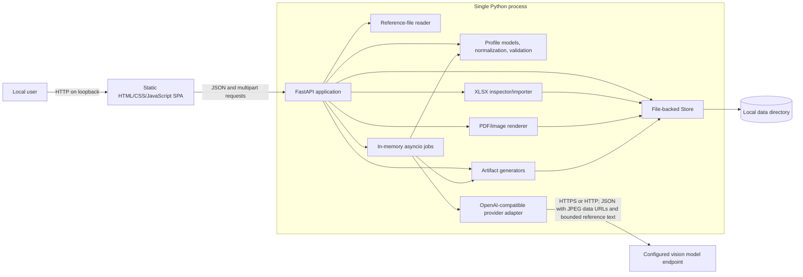
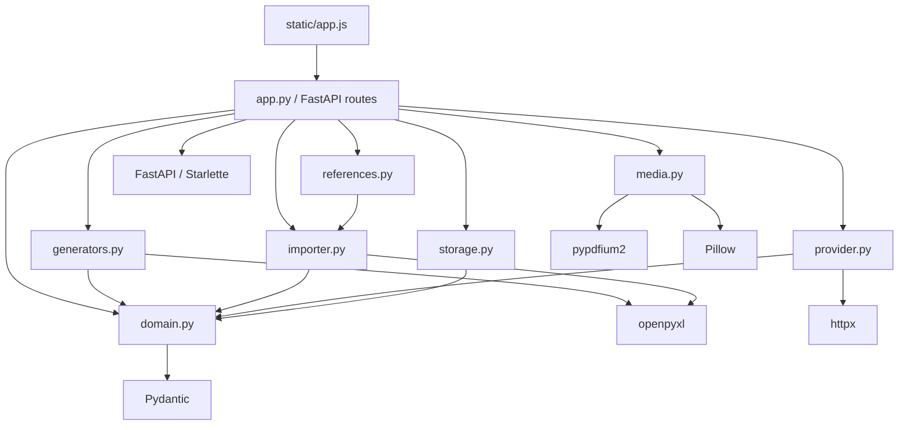

# Datara Profile Generator: Implemented Architecture

## Scope and evidence convention

This document reverse-engineers the system that is implemented in this repository. Runtime Python and browser code are the source of truth. `docs/design.md` is useful historical context, but it includes proposed and future behavior and is therefore not treated as implementation evidence here.

The following labels are used where a statement is not a direct code fact:

- **Implemented**: directly expressed by executable code.
- **Inferred**: an architectural consequence of several implemented behaviors, not a separately declared contract.
- **Not implemented**: a boundary that can be confirmed by the absence of a code path and, where available, by the README.

## System purpose

The application is a local, single-process editor and generator for Datara document-extraction Profiles. A `Profile` is the canonical runtime object. It contains document rules, one header table, optional directly attached detail tables, and fields classified as `AI`, `Manual`, or `System`.

From a validated Profile, the application deterministically produces four artifacts:

1. `field_mapping.xlsx`
2. `create_tables.sql`
3. `extraction_prompt.txt`
4. `output_structure.json`

It also supports importing Excel field definitions, preparing PDF/image samples, uploading bounded text/Office reference files, asking an OpenAI-compatible vision model to analyze document types and propose Profile/AI-field changes, running extraction tests, and validating returned JSON. It does not execute SQL, import a generated Profile into Datara, or provide the Datara runtime that populates `System` and `Manual` fields.

## High-level architecture

The deployed application is one Uvicorn/FastAPI process serving both a static browser client and JSON/file APIs. Persistent state is stored as files below one data directory. Model jobs are `asyncio` tasks held in process memory, with status/result snapshots written to disk. The only outbound integration is an OpenAI-compatible `/chat/completions` endpoint.



### Architectural characteristics

- **Implemented:** Local-first delivery. The supplied launchers bind Uvicorn to `127.0.0.1:8765`, and middleware rejects unapproved host names and cross-origin modifying requests.
- **Implemented:** Single-process state. Profiles and records are files; live jobs, task handles, the configured API key, and a write lock live in process memory.
- **Implemented:** Canonical Profile projection. Mapping, SQL, extraction prompt, and output structure are all generated from the same `Profile` instance.
- **Implemented:** Source-based extraction boundary. Only fields whose `source` is exactly `AI` enter extraction JSON, extraction prompts, and result validation. `Manual` and `System` fields remain in mapping and SQL.
- **Implemented:** Save and export are separate gates. Invalid drafts can be saved, while export and extraction testing reject Profile validation errors.
- **Not implemented:** Authentication, multi-user authorization, shared/database storage, a durable job queue, SQL execution/migration, and Datara deployment/import.

## Component responsibilities

| Component | Implemented responsibility | Explicit boundary |
|---|---|---|
| `datara/static/index.html`, `app.js`, `style.css` | Single-page UI; local Profile editing; sample/import upload; preview; settings; job polling; client-side dirty/revision handling | Holds mutable edit state in the browser; it is not a second domain model and relies on the API for authoritative normalization/validation |
| `datara/app.py` | Application composition, HTTP routes, middleware, error mapping, lifecycle cleanup, job orchestration, demo Profiles | Contains orchestration rather than generation rules; does not execute generated artifacts |
| `datara/domain.py` | Pydantic Profile/Table/Field models; forced field-name normalization; semantic type/display defaults; system-field catalog; Profile, result, and strict-JSON validation; AI-only projections/schema | Table names are validated rather than repaired; semantic rules are intentionally a bounded keyword heuristic |
| `datara/generators.py` | Deterministic Field Mapping rows/XLSX, SQL DDL, extraction prompt, JSON structure, fingerprint, preview, ZIP | Generates from a supplied Profile only; no model call and no database call |
| `datara/importer.py` | Safe-ish XLSX opening/limits, workbook inspection, full-Mapping and ordinary-list parsing, optional structural repairs | Imports field metadata only; it cannot reconstruct extraction/population rules, SQL overrides, or review history from generated XLSX |
| `datara/media.py` | Converts PDF pages and supported images into bounded JPEG pages | No OCR or field extraction; PDF processing is serialized by a global lock |
| `datara/provider.py` | Connection model/validation; OpenAI-compatible multimodal request; analysis prompt; strict parsing/filtering of Profile and AI-field add/update suggestions | One Chat Completions protocol only; no retries, streaming, native PDF, tool calling, or enforced structured-output mode; suggestions require user application |
| `datara/references.py` | Extracts bounded text from XLSX, DOCX, TXT, Markdown, JSON, CSV, and SQL uploads | Treats content only as model context; no macros/code execution, OCR, PDF parsing, or semantic trust decision |
| `datara/storage.py` | Directory creation, identifier-safe paths, atomic JSON writes, Profile listing/loading, optimistic revision saves, cascading Profile deletion, optimizer version allocation | Local filesystem only; the re-entrant write lock is process-local, not a cross-process lock |
| `datara/optimizer*.py`, `evaluation.py` | Deterministic optimizer state machine, test/ground-truth snapshots, field comparisons, regression gates, prompt versions, promotion, and rollback | Qwen proposes field rules; application code owns mutation, scoring, selection, and release gates |
| `scripts/diagnose.py` | Read-only dependency, local port, data-directory, proxy/CA, and optional endpoint diagnostics | Does not read API keys or send documents |
| `tests/` | Executable assertions for core generation, import, API, security, provider, and result-validation behavior | Provider tests use mock HTTP; no live model, Datara, or SQL Server integration test |

### HTTP API surface

| Area | Routes |
|---|---|
| Shell/diagnostics | `GET /`, `GET /api/meta`, `GET /api/health` |
| Profiles | `GET /api/profiles`, `POST /api/profiles/new`, `GET /api/profiles/{id}`, `POST /api/profiles/save`, `DELETE /api/profiles/{id}`, `POST /api/normalize` |
| Local field assistance | `POST /api/fields/suggest` |
| Generation | `POST /api/preview`, `POST /api/export`, `POST /api/schema` |
| Result checking | `POST /api/results/validate` |
| Samples | `POST /api/samples`, `GET /api/samples/{id}`, `GET /api/samples/{id}/pages/{page}` |
| Reference files | `POST /api/references`, `GET /api/references/{id}` |
| Excel import | `POST /api/import/inspect`, `POST /api/import/apply` |
| Model settings | `GET /api/settings`, `POST /api/settings`, `POST /api/settings/test` |
| Model jobs | `POST /api/jobs`, `GET /api/jobs/{id}`, `POST /api/jobs/{id}/cancel`, `GET /api/profiles/{id}/tests` |
| Prompt Optimizer | `/api/optimizer/profiles/{id}/test-cases`, `/api/optimizer/test-cases/{id}/ground-truth`, `/api/optimizer/runs`, `/api/optimizer/runs/{id}`, `/api/optimizer/runs/{id}/iterations`, and cancellation routes |
| Prompt versions | `GET /api/profiles/{id}/prompt-versions`, `GET /api/prompt-versions/{id}`, `GET /api/prompt-versions/compare`, promotion, and rollback routes |
| Built-in examples | `POST /api/demo/{cheque|invoice}` |

There are no partial-update Profile endpoints: edits replace a whole Profile through the save route. `DELETE /api/profiles/{id}` is the only deletion operation. It removes the Profile together with the records that belong exclusively to it (prompt versions and prompt state, optimizer test cases, ground truth, runs, iterations, extractions, promotions, model job records, and export metadata/ZIP archives), and it is refused with `409` while a model job or optimizer run for that Profile is still live. Sample, reference, and import uploads are shared workspace objects, so they are deliberately kept; there is still no deletion route for them.

## Main module/component relationships



## End-to-end data flow

### 1. Profile creation or import

The UI either requests a new/default or demo Profile, or uploads an `.xlsx`. A new Profile contains a single `AI_Document` head table and required system fields. A full Mapping is identified by five required headers; an ordinary list requires the user to map at least a name column. Import creates a new Profile and can optionally repair limited table-level inconsistencies.

### 2. Profile editing and normalization

The browser edits the Profile JSON directly. It can add fields, add only detail tables, reorder fields, and edit metadata. Calls to save, preview, normalization, local suggestion, and model-job creation run `normalize()`. It force-converts nonconforming field names to deterministic snake_case, resolves collisions with numeric suffixes, appends missing system fields, and rewrites `field_order` from list position. The local suggestion endpoint also applies bounded semantic type rules and fills unused HeadDisplay positions 1–5 for head-table AI fields. Only import calls `normalize(..., repair_system=True)`, which can overwrite malformed existing reserved fields.

### 3. Preview and validation

The browser debounces edits and posts the Profile to `/api/preview`. The API normalizes the request object and calls `preview()`. If Profile errors exist, the preview contains issues and a fingerprint only. Otherwise it contains mapping columns/rows, SQL, prompt, JSON structure, warnings, and the fingerprint.

### 4. Save and versioning

`Store.save()` compares the submitted revision with the persisted revision while holding a process-local lock. A successful save increments `revision`, stamps UTC `updated_at`, and atomically replaces the Profile JSON. The save endpoint does not require a valid Profile.

After the Profile is written, `ensure_prompt_version()` keeps the active prompt baseline consistent. Validity is decided by `prompt_fingerprint()`, which hashes only prompt-relevant content (table names, field order, prompt headings, field attributes, and AI extraction rules). Workspace-only state therefore never invalidates the baseline: attaching a sample, selecting a reference file, or renaming the database does not create a prompt version. When prompt-relevant content did change, an imported baseline is carried forward verbatim as a new `imported_prompt_refresh` version that re-appends the changed AI rules as the override block, because the generators cannot rebuild published external prompt text. Only a generated baseline is re-rendered from the Profile.

### 5. Export

Export normalizes the request, reloads the persisted Profile, and requires both its revision and content fingerprint to match the request. After Profile validation, the four generated files are written to a ZIP. The response returns that ZIP and the server retains the ZIP plus a Profile/fingerprint snapshot under `exports/`.

### 6. Optional sample/model flows

Uploaded PDFs, PNGs, or JPEGs are stored locally; all are converted to JPEG pages for preview/model input. Reference XLSX/DOCX/text-like files are converted to bounded text and stored separately. An analysis job sends the complete current field/rule context, selected sample pages, selected reference text, and the user's field request to the configured endpoint. Reference content is explicitly delimited inside the single user text part, before the image parts; using one text part avoids a known incompatibility in OpenAI-compatible enterprise gateways that accept multimodal arrays but reject repeated text parts. Both prompts explicitly treat document content as untrusted data rather than instructions. Returned suggestions may update Profile document rules and add or update AI fields on existing tables; they cannot modify Manual/System fields or create tables, and nothing is applied until the user selects it. An extraction job sends the generated extraction prompt and images, strictly parses the returned JSON, and validates it against the AI-only Profile projection.

### 7. Job persistence and restart behavior

The API permits at most two live model tasks per process. A job record is written before execution and updated at completion, cancellation, or failure. On startup, disk records still marked `running` become `interrupted`. Tasks themselves are not resumed. The browser polls every 1.5 seconds, backing off to 4 seconds after polling errors.

## Persistent data layout

With the default `DATARA_DATA_DIR=data`, `Store` creates:

```text
data/
  profiles/<profile-id>.json
  samples/<sample-id>/meta.json
  samples/<sample-id>/original.<pdf|png|jpg|jpeg>
  samples/<sample-id>/<page>.jpg
  references/<reference-id>.json
  imports/<import-id>.xlsx
  tests/<job-id>.json
  exports/<export-id>.zip
  exports/<export-id>.json
  optimizer/{prompt_states,prompt_versions,test_cases,ground_truth,runs,iterations,extractions,promotions}/*.json
  connection.json
```

Profile JSON, job JSON, export metadata, sample metadata, and connection settings use atomic temporary-file replacement. Uploaded originals, imported workbooks, and ZIP bytes use direct writes. The API key is intentionally absent from `connection.json`; only non-secret connection settings are persisted.

## External dependencies

### Python packages

| Dependency | Implemented use |
|---|---|
| FastAPI / Starlette / Uvicorn | HTTP application, static files, uploads, responses, middleware, lifecycle, ASGI server |
| Pydantic 2 | Strict request/domain models and bounds |
| `python-multipart` | Multipart file-upload parsing used by FastAPI |
| `openpyxl` | XLSX inspection/import and Field Mapping creation |
| `pypdfium2` | PDF page rendering |
| Pillow | Input image decoding, EXIF orientation, RGB conversion, resizing, JPEG output |
| `httpx` | Async OpenAI-compatible API calls and environment proxy/CA use |
| pytest (development) | Automated tests |

Versions are bounded in `pyproject.toml` and concretely locked in `uv.lock`.

### External services and operating-system facilities

- A configured OpenAI-compatible endpoint at `<base_url>/chat/completions` is needed only for connection tests, AI field suggestions, and extraction tests.
- The deterministic preview/export path does not need a model, Datara, or SQL Server.
- Filesystem durability relies on `fsync` and same-filesystem `os.replace` for JSON writes.
- Proxy and TLS trust settings are inherited by `httpx` from the launching process.

## Configuration and environment variables

### Application environment

| Variable | Default | Implemented effect | Persistence |
|---|---:|---|---|
| `DATARA_DATA_DIR` | `data` relative to the process working directory | Root for profiles, samples, references, imports, tests, exports, and `connection.json` | Environment only |
| `DATARA_API_KEY` | empty | Initial API key loaded into `app.state.api_key` | Memory only; UI updates also remain memory-only |
| `DATARA_ALLOWED_HOSTS` | empty | Comma-separated additions to `localhost`, `127.0.0.1`, `::1`, and `testserver` accepted by host middleware | Environment only |
| `DATARA_LOG_LEVEL` | `WARNING` | Root logger level set by `configure_logging()` at import. `INFO` enables the `model_request_started` / `model_request_finished` timings from `datara.provider`. Unrecognised values fall back to `WARNING` and log a warning rather than aborting startup | Environment only |
| `HTTP_PROXY`, `HTTPS_PROXY`, lowercase equivalents, `ALL_PROXY`, `NO_PROXY` | inherited/empty | Used by `httpx` because `trust_env=True` | Environment only |
| `SSL_CERT_FILE`, `SSL_CERT_DIR` | inherited/empty | Supplies custom TLS trust locations to the HTTP stack | Environment only |
| `PYTHONUTF8` | set to `1` by `run.cmd` only | Enables UTF-8 mode on Windows launcher runs | Process only |

`app.py` calls `load_runtime_environment()` at import time, which loads `.env` from the process working directory with `override=False`, so variables already set by the operating system, container or CI always win. `.env.example` documents `DATARA_DATA_DIR`, `DATARA_API_KEY` and `DATARA_LOG_LEVEL`; it omits `DATARA_ALLOWED_HOSTS` and the inherited networking variables.

`configure_logging()` runs immediately afterwards. It is required because uvicorn's `--log-level` only calls `setLevel` on `uvicorn.error`, `uvicorn.access` and `uvicorn.asgi` (`uvicorn/config.py:413-420`) and uvicorn's default `LOGGING_CONFIG` contains no `root` entry. Without it, `datara.provider` records propagate to a handler-less root logger and fall through to `logging.lastResort`, whose level is `WARNING`, so the model request timings are dropped even when `--log-level info` is passed. A root handler is added only when none exists, so pytest's logging plugin is left intact.

### Persisted connection settings

`connection.json` stores:

| Setting | Default | Constraint/use |
|---|---|---|
| `base_url` | `https://dashscope.aliyuncs.com/compatible-mode/v1` | HTTP(S) URL with host and without embedded credentials, query, or fragment; `/chat/completions` is appended |
| `model` | `qwen3.8-max-0902` | Nonblank model identifier sent in every request |
| `timeout` | `600` seconds | 10–1800 seconds overall; connect timeout is separately fixed at 15 seconds |
| `max_tokens` | `4096` | 256–32768; sent as `max_tokens` |

Two independent time budgets apply to every model call. `timeout` bounds the whole logical request, including optimizer retries and backoff, through `asyncio.timeout`, and is also passed to HTTPX. Connection setup is separately bounded by a fixed 15 second connect timeout that has no configuration field. The two failures are reported differently on purpose: a connect timeout surfaces as `无法连接模型端点：建立连接超过 15 秒连接超时…` and keeps one retry, whereas a response timeout surfaces as `模型请求超时，可调整超时设置后重试` and is not retried because it may already have consumed the entire budget. Raising `timeout` therefore cannot fix a connect-phase failure. `datara.provider` logs `model_request_connect_timeout` and `model_request_network_error` with the underlying HTTPX exception type so the two stay distinguishable in the field. The retry budget is defined once, in `provider.classify_transient`, and shared by the optimizer (`Optimizer._complete_attempts`) and by interactive extract/draft jobs (`provider.completion_retrying`, called from `app.run_job`); the latter previously called the model exactly once, so a single 15 second proxy blip failed the whole run even though its own error text said the failure was retryable.


HTTP (without TLS) is accepted by validation. Redirect following is disabled. The supplied launchers hard-code `127.0.0.1:8765`; there is no application environment variable for listen address or port.

## Validation, security, and operational boundaries

- All application request models reject unknown properties (`extra="forbid"`).
- Middleware caps declared request size at 25 MiB, with stricter 20 MiB sample and 8 MiB workbook/reference reads. Extracted reference text is capped at 60,000 characters per file and in the combined model context.
- PDFs are limited to 15 pages; source raster images are limited to 40 million pixels; generated JPEG input for one model call is limited to 18 MiB; model responses are limited to 5 MiB.
- The app adds `nosniff`, no-referrer, no-store, and a restrictive Content Security Policy.
- Modifying requests with a present, mismatched `Origin` are rejected. There is no login or CSRF token; the design relies on loopback binding plus host/origin checks.
- Endpoint errors are mapped to bounded user messages; provider response bodies are not included in non-2xx errors. A job failure also replaces the exact API-key string before persisting its message.
- Generated SQL is quoted and limited to an allowlist of type forms. It is returned as a file and never executed.

## Inconsistencies, duplicated logic, hard-coded assumptions, and technical debt

### Model and generation

1. **Naming repair is deliberately narrow and hard-coded.** Field names are forced to snake_case and collisions get numeric suffixes. A small Chinese alias map produces readable names; other non-ASCII characters use deterministic Unicode-codepoint tokens. Table/database/schema names are still validated rather than repaired.
2. **Field order has two representations.** `FieldDef.field_order` is stored, but normalization and mapping output derive order from list position. Imported `FieldOrder` values are ignored.
3. **Mapping round-trip is lossy.** Generated XLSX omits Profile descriptions/rules, field descriptions, extraction/population instructions, SQL overrides, review state, internal IDs, and sample references. Reimport therefore cannot recreate the saved Profile.
4. **Full-Mapping detection is partial.** Only five of the eleven generated columns are required to classify a sheet as a full Mapping. Missing optional columns silently take defaults.
5. **SQL type compatibility is shallow.** Custom `sql_type` syntax is validated, but compatibility with `data_type` is not. For example, a Decimal field can be assigned a character type; decimal precision validation then no longer runs.
6. **Required has different meanings across outputs.** `is_required` is exported to Mapping, is identified in the extraction prompt, and turns a returned `null` into a warning, but SQL still keeps business fields nullable.
7. **JSON Schema and runtime validation are duplicated.** `/api/schema` constructs a schema, but extraction result validation uses handwritten logic and the schema is neither used nor exported. The schema checks only the date shape; handwritten validation checks calendar validity and decimal storage bounds.
8. **Prompt conflict detection is heuristic.** Two regular expressions cover a small set of Chinese default-value phrases and four system-field names. Other semantic conflicts pass through to the model.

### Import and inference

9. **Import and local inference heuristics are hard-coded.** Unknown/missing types start as `String`, then date/amount/quantity/count/name keywords can override the type. Unknown sources become `AI`; booleans use a small truthy vocabulary; `company_code`, `current_date`, and `AI_Invoice_Detail.item` are special-cased as `System`.
10. **Header/detail repair uses first occurrence.** With repair enabled, a later conflicting table level is changed to the first-seen role and its field stays on that table. Only a blank parent with exactly one head is inferred; explicit bad/conflicting parents still fail.
11. **AI suggestions cannot design table structure.** They may add or update AI fields only on exact, existing table names and can suggest document rules. Table creation/classification is still a prior manual/import step.
12. **Whitespace handling is inconsistent.** Headers and field names are trimmed; imported table names, parent values, type strings, and source strings are not consistently trimmed before classification.

### Runtime and storage

13. **Jobs are not durable work.** Records persist, but task execution and cancellation handles are memory-only. Restart converts `running` to `interrupted`; there is no resume, and a failed job is never re-queued. Transient model failures *within* a running job are retried per `classify_transient`, but that budget is exhausted before the job is marked `failed`.
14. **Job history is only partially reproducible.** Extraction records store a Profile fingerprint and prompt hash, not the full Profile or prompt. Direct API clients can start a job from an unsaved Profile because job creation does not enforce the saved-revision check used by export.
15. **Persistence failure isolation is limited.** Corrupt `connection.json`, Profile JSON, or test JSON can fail startup/listing endpoints because records are read without quarantine or per-record recovery.
16. **Not all writes are atomic.** Profile/metadata JSON uses atomic replacement; imported XLSX, original samples, and export ZIPs use direct `write_bytes`.
17. **No retention/deletion path exists.** Samples, imports, exports, job records, and completed jobs accumulate; completed records also remain in the in-memory `jobs` dictionary for the process lifetime.
18. **Profile test lookup does not verify Profile existence.** The route constructs a validated path but does not read the Profile before scanning job records.
19. **Local security is deployment-sensitive.** `validate_connection` permits plain HTTP, and host/origin middleware is not authentication. Running Uvicorn on a non-loopback interface or adding broad allowed hosts changes the trust boundary.

### Duplication and hard-coded constants

20. System field names/types and several business exceptions are hard-coded in `domain.py` and `importer.py`; demo business schemas are hard-coded in `app.py`.
21. Version `0.1.0` is duplicated in `pyproject.toml` and two API responses; the UI separately displays `v0.1`.
22. Limits and operational constants are distributed across middleware, endpoints, media, provider, Pydantic models, and JavaScript rather than centralized.
23. ZIP member timestamps are fixed to `2026-01-01 00:00:00`; this helps reproducibility but is an unexplained hard-coded date rather than Profile metadata.
24. Reference extraction is format-specific and text-only: DOCX tables are flattened with paragraph text, XLSX is serialized as JSON rows with blank rows and trailing blank cells removed, and scanned reference documents require the sample-image path.

## Architecture traceability table

The table maps each major architecture statement to executable modules and symbols. Symbol references are used so traceability survives unrelated line movement.

| ID | Major design statement | Status | Implementation evidence |
|---|---|---|---|
| A-01 | The system is a local Profile editor and deterministic four-artifact generator | Implemented | `pyproject.toml`; `datara/generators.py:preview,export_zip`; `datara/static/app.js:renderPreview` |
| A-02 | One FastAPI process serves the SPA and API | Implemented | `datara/app.py:create_app`; `datara/static/index.html`; `run.command`; `run.cmd` |
| A-03 | `Profile` is the common input to all generation projections | Implemented | `datara/domain.py:Profile`; `datara/generators.py:mapping_rows,sql,prompt,preview,export_zip` |
| A-04 | Only `Source=AI` enters extraction-facing structures | Implemented | `datara/domain.py:ai_tables,json_structure,json_schema,validate_result`; `datara/generators.py:prompt` |
| A-05 | Local storage uses Profile/sample/reference/import/test/export directories | Implemented | `datara/storage.py`; upload routes in `datara/app.py` |
| A-06 | Profile saves use optimistic revision control and atomic JSON replacement | Implemented | `datara/storage.py:Store.write_json,Store.save`; conflict handler in `datara/app.py:create_app` |
| A-07 | Invalid drafts may be saved, but export and extraction are validation-gated | Implemented | save/export/job routes in `datara/app.py:create_app`; `datara/generators.py:preview,export_zip` |
| A-08 | Export requires a persisted revision/content match and retains a snapshot | Implemented | export route in `datara/app.py:create_app`; `datara/generators.py:fingerprint` |
| A-09 | Samples are locally converted to JPEG pages before model calls | Implemented | sample/job routes in `datara/app.py:create_app`; `datara/media.py:prepare`; `datara/provider.py:completion` |
| A-10 | Model integration is OpenAI-compatible Chat Completions | Implemented | `datara/provider.py:Connection,completion` |
| A-11 | Live jobs are in-memory asyncio tasks with disk records | Implemented | `datara/app.py:create_app,run_job` |
| A-12 | Restart interrupts rather than resumes live jobs | Implemented | startup reconciliation in `datara/app.py:create_app` |
| A-13 | Browser polling drives asynchronous job UX | Implemented | `datara/static/app.js:pollJob` |
| A-14 | Required system fields and direct head/detail topology are centrally enforced | Implemented | `datara/domain.py:SYSTEM,normalize,validate_profile` |
| A-15 | The app is local-guarded but has no user authentication | Implemented / inferred boundary | host/origin middleware in `datara/app.py:create_app`; no authentication dependency or route guard exists |
| A-16 | API keys are memory-only and excluded from persisted settings/responses | Implemented | settings routes in `datara/app.py:create_app`; `datara/provider.py:public_connection`; `tests/test_app.py` |
| A-17 | Proxy and CA settings are inherited from the environment | Implemented | `datara/provider.py:completion`; `scripts/diagnose.py` |
| A-18 | SQL is generated but never executed | Implemented / inferred boundary | `datara/generators.py:sql`; no database client dependency in `pyproject.toml` |
| A-19 | AI analysis proposes document rules and AI-field additions/updates on existing tables, subject to user review | Implemented | `datara/provider.py:draft_prompt,parse_analysis`; `datara/app.py:run_job`; `datara/static/app.js:analysisModal` |
| A-20 | The test suite is mock/local rather than live integration verification | Implemented | `tests/test_provider.py`; `tests/test_app.py`; dependency scope in `pyproject.toml` |
| A-21 | Field names are deterministically forced to snake_case and collisions are suffixed | Implemented | `datara/domain.py:snake_name,normalize`; tests in `tests/test_analysis.py` |
| A-22 | Mapping import/export cannot round-trip the full Profile | Implemented / inferred from compared schemas | `datara/domain.py:Profile,COLUMNS`; `datara/generators.py:mapping_rows`; `datara/importer.py:parse_fields` |
| A-23 | There is no durable queue, shared storage, or SQL/Datara deployment path | Not implemented | task creation in `datara/app.py:create_app`; filesystem-only `datara/storage.py:Store`; `pyproject.toml` |
| A-24 | Reference files are bounded, converted to text, and isolated from system instructions | Implemented | `datara/references.py:reference_text`; `datara/provider.py:completion,draft_prompt`; tests in `tests/test_analysis.py` |
| A-25 | Semantic type and HeadDisplay suggestions are available without a model | Implemented | `datara/domain.py:infer_type,suggest_displays`; `datara/app.py` route `/api/fields/suggest`; `datara/importer.py` |
| A-26 | Deleting a Profile cascades to its derived records, keeps shared uploads, and is blocked while a job or optimizer run is live | Implemented | `datara/storage.py:Store.delete_profile,PROFILE_OWNED_FOLDERS`; `datara/app.py` route `DELETE /api/profiles/{id}`; tests in `tests/test_app.py` |
