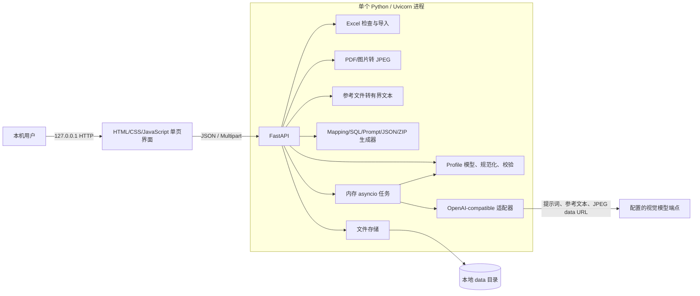
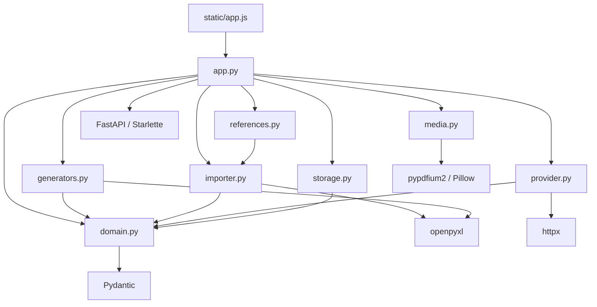

# Datara Profile Generator：当前实现架构

## 文档范围与事实标准

本文从当前仓库的 Python、浏览器端 JavaScript、启动脚本和自动测试反向整理系统设计。代码是事实标准；`docs/design.md` 含历史方案和规划，不代表所有内容均已实现。

- **已实现**：可以在可执行代码或测试中直接找到。
- **推断**：由多段已实现行为共同得出的架构结论，不是单独声明的接口契约。
- **未实现**：当前仓库中不存在对应执行路径。

## 系统用途

这是一个本地运行的 Datara 文档提取 Profile 编辑与生成工具。`Profile` 是唯一的核心定义，包含：

- 可接受/排除的单据及识别规则；
- 一张主表和可选的直属子表；
- `AI`、`Manual`、`System` 三种来源的字段；
- 样张和参考文件 ID；
- 数据库、SQL 类型和展示配置。

一个通过校验的 Profile 会确定性生成四份一致的产物：

1. `field_mapping.xlsx`
2. `create_tables.sql`
3. `extraction_prompt.txt`
4. `output_structure.json`

应用也支持 Excel 字段导入、PDF/图片样张预处理、多格式参考文件解析、AI 单据/字段分析、真实提取测试和 JSON 结果校验。它不会执行 SQL，也不会把配置直接部署到 Datara。

## 高层架构



主要特点：

- 本地优先；启动脚本默认只监听 `127.0.0.1:8765`。
- 单进程；Profile 和任务记录落盘，运行任务、API Key 和锁保存在内存。
- 四份产物始终由同一个 Profile 投影生成。
- 只有 `Source=AI` 的字段进入提取提示词、JSON 结构和结果校验；其他字段仍进入 Mapping 与 SQL。
- 草稿可在存在校验错误时保存；预览完整产物、导出和提取测试需要通过校验。
- 没有登录、多用户权限、数据库存储、持久任务队列、SQL 执行和 Datara 发布能力。

## 组件职责

| 组件 | 当前职责 | 边界 |
|---|---|---|
| `datara/static/index.html`、`app.js`、`style.css` | Profile 编辑、拖拽上传、可折叠界面、预览、模型设置、任务轮询和人工审核 | 浏览器状态不是权威校验；保存/生成仍以后端为准 |
| `datara/app.py` | FastAPI 组合、路由、中间件、错误映射、任务编排和示例 Profile | 不包含数据库执行或 Datara 发布逻辑 |
| `datara/domain.py` | Pydantic 模型、snake_case 修正、类型/HeadDisplay 建议、System 字段、Profile/结果校验 | 表名只校验不修正；语义类型是有限关键词规则 |
| `datara/generators.py` | Mapping、SQL、提取提示词、JSON 结构、指纹、预览和 ZIP | 只消费 Profile，不调用模型或数据库 |
| `datara/importer.py` | XLSX 安全限制、预览、完整 Mapping/普通列表解析和有限结构修复 | Mapping 回导无法恢复提取规则、SQL 覆盖和审核历史 |
| `datara/media.py` | PDF/PNG/JPEG 转换为尺寸受控的 JPEG 页面 | 不做 OCR；PDF 渲染使用全局锁串行执行 |
| `datara/references.py` | 读取 XLSX、DOCX、TXT、MD、JSON、CSV、SQL 为有界文本 | 不执行宏、公式、SQL 或文件内指令；扫描件需走样张路径 |
| `datara/provider.py` | 模型连接配置、Chat Completions 多模态请求、分析提示词、返回解析与过滤 | 无重试、流式输出、原生 PDF、工具调用或协议级 JSON Schema |
| `datara/storage.py` | 安全路径、目录、原子 JSON 写入、Profile 列表/读取、乐观版本保存和优化版本分配 | 仅本地文件系统；可重入写锁只在单进程内有效 |
| `datara/optimizer*.py`、`evaluation.py` | 固定优化状态机、测试/标准答案快照、字段比较、回归门禁、提示词版本、发布与回滚 | Qwen 只建议字段规则；应用代码负责变更、评分、选择和发布门禁 |
| `scripts/diagnose.py` | 只读检查依赖、端口、数据目录、代理、CA 和可选端点 | 不读取 API Key，不上传文档 |

## HTTP 接口

| 功能 | 路由 |
|---|---|
| 页面与健康 | `GET /`、`GET /api/meta`、`GET /api/health` |
| Profile | `GET /api/profiles`、`POST /api/profiles/new`、`GET /api/profiles/{id}`、`POST /api/profiles/save`、`POST /api/normalize` |
| 本地字段建议 | `POST /api/fields/suggest` |
| 生成 | `POST /api/preview`、`POST /api/export`、`POST /api/schema` |
| 结果校验 | `POST /api/results/validate` |
| 样张 | `POST /api/samples`、`GET /api/samples/{id}`、`GET /api/samples/{id}/pages/{page}` |
| 参考文件 | `POST /api/references`、`GET /api/references/{id}` |
| Excel 导入 | `POST /api/import/inspect`、`POST /api/import/apply` |
| 模型设置 | `GET /api/settings`、`POST /api/settings`、`POST /api/settings/test` |
| 模型任务 | `POST /api/jobs`、`GET /api/jobs/{id}`、`POST /api/jobs/{id}/cancel`、`GET /api/profiles/{id}/tests` |
| 提示词优化 | `/api/optimizer/profiles/{id}/test-cases`、`/api/optimizer/test-cases/{id}/ground-truth`、`/api/optimizer/runs`、任务读取、迭代读取及取消路由 |
| 提示词版本 | `GET /api/profiles/{id}/prompt-versions`、`GET /api/prompt-versions/{id}`、版本比较、发布及回滚路由 |
| 示例 | `POST /api/demo/{cheque|invoice}` |

没有 Profile 或上传对象的删除接口。Profile 更新通过提交完整对象完成。

## 主要模块关系



## 端到端数据流

1. **创建或导入**：新建/示例生成一张主表；Excel 导入自动判断完整 Mapping 或普通字段表。
2. **编辑与规范化**：前端编辑 Profile；后端把非规范字段名强制转为 snake_case、处理冲突、补 System 字段并重算顺序。
3. **本地建议**：无需模型即可根据字段名/说明推断常见日期、金额、数量、计数和标识符类型，并给主表 AI 字段补 1–5 的 HeadDisplay。
4. **预览**：规范化后校验。错误存在时只返回问题和指纹；通过时返回四种产物预览。
5. **保存**：进程内锁保护乐观 revision 检查；保存增加 revision、写 UTC 时间并原子替换 JSON。保存本身不要求 Profile 有效。
6. **导出**：请求必须与已保存 revision 和内容指纹一致；校验后生成 ZIP，并保留 ZIP 与 Profile 快照。
7. **AI 分析**：把完整当前字段/规则、一个样张的 JPEG 页面、选中的参考文本和用户字段需求发送到模型。参考资料放在唯一的 user 文本块内并明确标界，JPEG 作为其后的图片块；这是为兼容会拒绝重复文本块的企业 OpenAI-compatible 网关。上传内容明确被视为不可信数据。模型可建议单据类型、规则及现有表中的 AI 字段新增/更新，但不能修改 Manual/System 或创建表；用户勾选后才应用。
8. **提取测试**：将 AI-only 提取提示词和样张发给模型；严格解析 JSON 并按 Profile 校验键、结构、类型、日期、Choice 和 Decimal 范围。
9. **任务生命周期**：最多同时运行两个任务。任务记录落盘，执行句柄在内存；重启后运行中记录变为 `interrupted`，不会自动恢复。

## 本地数据布局

```text
data/
  profiles/<profile-id>.json
  samples/<sample-id>/meta.json
  samples/<sample-id>/original.<pdf|png|jpg|jpeg>
  samples/<sample-id>/<page>.jpg
  references/<reference-id>.json
  imports/<import-id>.xlsx
  tests/<job-id>.json
  exports/<export-id>.zip
  exports/<export-id>.json
  optimizer/{prompt_states,prompt_versions,test_cases,ground_truth,runs,iterations,extractions,promotions}/*.json
  connection.json
```

API Key 不写入 `connection.json`，只保存在当前进程内或来自环境变量。仓库规则禁止提交 `data/`、真实业务样张、提取结果或密钥。

## 外部依赖

| 依赖 | 用途 |
|---|---|
| FastAPI / Starlette / Uvicorn | Web 应用、静态文件、上传、ASGI 服务 |
| Pydantic 2 | 严格请求与领域模型 |
| `python-multipart` | Multipart 上传 |
| `openpyxl` | Excel 导入和 Field Mapping 生成 |
| `pypdfium2` | PDF 页面渲染 |
| Pillow | 图片解码、方向修正、缩放和 JPEG 输出 |
| `httpx` | OpenAI-compatible 异步请求、代理与 CA 环境继承 |
| pytest | 自动测试 |

只有模型连接测试、AI 分析和提取测试需要外部模型端点。确定性预览/导出不依赖模型、Datara 或 SQL Server。

## 配置与环境变量

| 环境变量 | 默认值 | 作用 |
|---|---|---|
| `DATARA_DATA_DIR` | `data` | Profile、样张、参考、导入、测试、导出及连接配置根目录 |
| `DATARA_API_KEY` | 空 | 启动时注入内存中的 API Key |
| `DATARA_ALLOWED_HOSTS` | 空 | 在本地默认 Host 白名单外追加允许 Host |
| `HTTP_PROXY`、`HTTPS_PROXY`、`ALL_PROXY`、`NO_PROXY` 及小写形式 | 继承 | `httpx` 网络代理 |
| `SSL_CERT_FILE`、`SSL_CERT_DIR` | 继承 | 企业 TLS 信任链 |
| `PYTHONUTF8` | Windows 启动脚本设置为 `1` | Windows UTF-8 模式 |

`connection.json` 保存非敏感设置：

| 设置 | 默认值 | 范围/用途 |
|---|---:|---|
| `base_url` | `https://dashscope.aliyuncs.com/compatible-mode/v1` | 有主机、无内嵌账号/查询/片段的 HTTP(S) 基础地址 |
| `model` | `qwen3.8-max-0902` | 请求使用的模型 ID |
| `timeout` | 600 秒 | 总请求超时 10–1800 秒；连接超时固定 15 秒 |
| `max_tokens` | 4096 | 256–32768 |

应用不自动读取 `.env`。启动脚本固定监听 `127.0.0.1:8765`。

## 校验、安全与容量边界

- Pydantic 模型拒绝未知属性。
- 通用请求声明上限 25 MiB；样张 20 MiB；Excel/参考文件 8 MiB。
- PDF 1–15 页；原始图片最多 4000 万像素；一次模型调用的 JPEG 总量最多 18 MiB；模型响应最多 5 MiB。
- 单个参考文本与一次调用的参考合计均不超过 60,000 字符。
- 修改请求若带有不匹配的 `Origin` 会被拒绝；Host 受白名单限制。该机制不是用户认证。
- CSP、`nosniff`、无 Referrer、`no-store` 响应头由中间件添加。
- 第三方错误不会返回响应正文；任务错误持久化前会替换精确 API Key。
- SQL 标识符会转义、SQL 类型有白名单；SQL 只作为文件返回，不执行。

## 已知不一致、重复逻辑和技术债

1. 字段名修正依赖少量中文别名；未知非 ASCII 字符编码为 Unicode 码点，可用但不一定业务友好。表/库/schema 名不自动修复。
2. `field_order` 与字段数组顺序重复；规范化和 Mapping 实际使用数组顺序。
3. Mapping 回导有损：缺少 Profile 规则、字段说明、提取/填充规则、SQL 覆盖、审核状态、内部 ID 和样张引用。
4. 完整 Mapping 判定只要求 11 列中的 5 列，其他列缺失时使用默认值。
5. 自定义 SQL 类型只校验语法，不校验与业务类型相容性。
6. `is_required` 在 Mapping/提示词中可见、结果 null 时产生警告，但 SQL 业务字段仍为 NULL。
7. `/api/schema` 与运行时结果校验是两套实现，可能漂移。
8. 提示词冲突检测依赖有限中文正则，不是通用语义分析。
9. 导入和本地类型推断依赖硬编码关键词及业务特例。
10. 结构修复按表第一次出现的定义为准；只能在父表唯一时补空父表。
11. AI 可新增/更新现有表的 AI 字段和单据规则，但不能创建/分类新表。
12. 表名、父表、来源/类型字符串的空白处理仍不完全一致。
13. 任务不是持久队列；重启不续跑，也没有自动重试。
14. 任务历史只保存指纹/提示词哈希，不保存完整请求快照。
15. 损坏的 JSON 记录没有隔离/修复机制，可能影响启动或列表读取。
16. 并非所有写入都原子：上传原件、导入 XLSX 和 ZIP 使用直接写入。
17. 无删除和保留策略，上传与任务记录会持续累积。
18. Host/Origin 防护依赖本地部署方式；若监听外网会改变信任边界。
19. 版本号、容量限制和业务特例分散在多个模块，未集中配置。
20. ZIP 时间戳固定为 2026-01-01，利于重复生成，但属于硬编码。
21. 参考文件会丢失部分格式；DOCX/XML 与 XLSX 只转换为文字/行，XLSX 的空白行和行尾空白单元格会省略，权威性由用户和模型判断。

## 架构追踪表

| ID | 主要设计事实 | 状态 | 实现证据 |
|---|---|---|---|
| A-01 | Profile 是四份产物的统一输入 | 已实现 | `datara/domain.py:Profile`；`datara/generators.py:mapping_rows,sql,prompt,export_zip` |
| A-02 | 单个 FastAPI 进程同时提供 SPA 与 API | 已实现 | `datara/app.py:create_app`；`run.command`；`run.cmd` |
| A-03 | 只有 AI 字段进入提取路径 | 已实现 | `datara/domain.py:ai_tables,validate_result`；`datara/generators.py:prompt` |
| A-04 | 保存使用 revision 与原子 JSON 替换 | 已实现 | `datara/storage.py:Store.write_json,Store.save` |
| A-05 | 导出绑定已保存 revision 和指纹 | 已实现 | `datara/app.py` 导出路由；`datara/generators.py:fingerprint` |
| A-06 | 样张统一转换为 JPEG 后发送 | 已实现 | `datara/media.py:render_pages`；`datara/provider.py:completion` |
| A-07 | 参考文件转换为受限、不可信文字上下文 | 已实现 | `datara/references.py:reference_text`；`datara/app.py:analysis_references` |
| A-08 | AI 可建议 Profile 文本及 AI 字段新增/更新 | 已实现 | `datara/provider.py:draft_prompt,parse_analysis`；`datara/static/app.js:analysisDialog` |
| A-09 | 字段名强制 snake_case 并处理冲突 | 已实现 | `datara/domain.py:snake_name,normalize`；`tests/test_analysis.py` |
| A-10 | 常见类型和 HeadDisplay 可本地建议 | 已实现 | `datara/domain.py:infer_type,suggest_displays`；`/api/fields/suggest` |
| A-11 | 模型使用 OpenAI-compatible Chat Completions | 已实现 | `datara/provider.py:completion` |
| A-12 | 任务运行在内存、记录落盘、重启中断 | 已实现 | `datara/app.py:create_app,run_job` |
| A-13 | API Key 不持久化 | 已实现 | `datara/app.py` 设置路由；`tests/test_app.py` |
| A-14 | SQL 只生成不执行 | 已实现/边界推断 | `datara/generators.py:sql`；`pyproject.toml` 无数据库客户端 |
| A-15 | 没有持久队列、共享存储或 Datara 发布路径 | 未实现 | `datara/app.py` 内存任务；`datara/storage.py:Store` |
