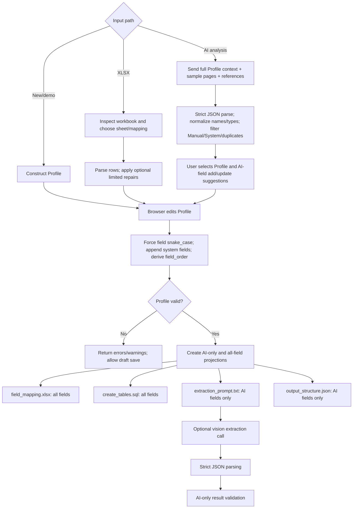

# Datara Generator: Implemented Design

## Scope

This document describes the generator and its adjacent import/test paths as they are implemented. “Inference” below means field-definition suggestions or import fallback behavior; the deterministic artifact generator itself does not inspect documents or infer fields.

The generator’s effective contract is:

```text
Profile -> normalize field names/system fields/order -> validate -> project -> four artifacts
```

All four artifacts are generated from the same in-memory Profile, but not every Profile property is represented in every artifact.

## Input format

### Canonical Profile JSON

Pydantic rejects unknown keys at every modeled level. The top-level schema version is exactly `"1.0"`.

| Object | Implemented fields |
|---|---|
| `Profile` | `id`, `schema_version`, `revision`, `name`, `description`, `accepted_documents`, `rejected_documents`, `document_rules`, `database_name`, `database_schema`, `tables`, `sample_ids`, `reference_ids`, `updated_at` |
| `TableDef` | `id`, `name`, `role` (`head` or `detail`), `parent_table_id`, `fields` |
| `FieldDef` | `id`, `name`, `description`, `source`, `data_type`, `is_required`, `choice_values`, `sample_data`, `head_display`, `field_order`, `sql_type`, `extraction`, `population`, `reviewed` |

Key bounds and enums include:

- At most 20 tables, 20 sample IDs, and 10 reference IDs per Profile.
- At most 200 fields per table; import stops at 190 to reserve room for system fields.
- `source` is one of `AI`, `Manual`, `System`.
- `data_type` is one of `String`, `Integer`, `Decimal`, `Date`, `Boolean`, `Choice`.
- `head_display`, if present, is 1–999.
- `sample_data` is only a JSON scalar (`string`, integer, float, boolean, or null).

### Excel inputs

The browser file picker restricts selection to `.xlsx`. The backend does not inspect the filename suffix; it expects ZIP-based OOXML workbook bytes that `openpyxl.load_workbook()` can open, so the content check rather than the upload name is decisive.

There are two parsing modes:

1. **Full Datara Mapping mode** is selected when the header row contains `TableName`, `TableLevel`, `ColumnName`, `Source`, and `DataType`. The other generated Mapping columns are optional during import.
2. **Ordinary field-list mode** is selected otherwise. The request must map a workbook column to `name`; it may also map `description`, `type`, and `source`. Every imported row goes into one default `AI_Document` head table.

Workbook safety/size rules:

- Upload read limit: 8 MiB.
- ZIP-expanded workbook limit: 50 MiB and 3,000 ZIP members.
- Per-sheet limit: 10,000 rows and 100 columns.
- Empty field-name rows are skipped.
- Formulas are loaded as formula text (`data_only=False`); dates/datetimes used as sample data become `YYYYMMDD` strings.

### Sample document inputs

The sample endpoint accepts PDF, PNG, JPG, and JPEG by filename suffix. It reads at most 20 MiB. PDFs must contain 1–15 pages. Raster inputs must not exceed 40 million pixels. Every accepted page is EXIF-adjusted, converted to RGB, bounded to 2200×3000, and saved as JPEG quality 88.

### Reference-file inputs

The reference endpoint accepts XLSX, DOCX, TXT, Markdown, JSON, CSV, and SQL uploads up to 8 MiB. Text-like files are decoded as UTF-8 (including BOM) with GB18030 fallback. XLSX is converted to JSON-like rows with a 1,000-row/100-column per-sheet bound; blank rows and trailing blank cells are omitted, while original nonblank row numbers are retained. DOCX paragraph text is extracted from bounded OOXML without running macros, links, formulas, SQL, or embedded instructions. A file producing no text is rejected; extracted text over 60,000 characters is rejected rather than silently truncated. PDF/images belong in the sample path because this reader performs no OCR.

Reference IDs are stored on the Profile. API responses expose only metadata; extracted text stays in the local reference record and is loaded only for the selected analysis job. The combined reference context sent to one model call is capped at 60,000 characters.

### AI analysis input/output

Analysis input consists of the current Profile, one sample ID, its selected reference IDs, and free-text field requirements. The complete table/field context and current document rules are placed in a system prompt. A single user text part contains the task marker and explicitly delimited reference text, followed by the sample JPEG parts. The single-text-part envelope is an implemented compatibility measure for enterprise OpenAI-compatible gateways that reject repeated text parts in one multimodal message. Both the system and user content explicitly state that commands inside samples/references are untrusted data and cannot redefine the task.

The model is asked to return:

```json
{
  "profile": {
    "accepted_documents": "suggested type and acceptance rule",
    "rejected_documents": "confusable excluded types",
    "document_rules": "detailed extraction rules"
  },
  "evidence": "document-type evidence",
  "questions": [],
  "fields": [
    {
      "table_name": "an_existing_table",
      "name": "field_name",
      "description": "说明",
      "data_type": "String|Integer|Decimal|Date|Boolean|Choice",
      "choice_values": [], "sample_data": null, "head_display": 1,
      "extraction": "识别规则",
      "evidence": "页面和依据"
    }
  ]
}
```

This is prompt-level instruction, not a provider-enforced JSON Schema. The returned text is parsed with the same strict JSON parser used for extraction results. Each field proposal is tagged `add` or `update`; existing `Manual` and `System` fields are filtered out. Applying any suggestion remains an explicit UI action.

### Extraction result input

The model or manual-validation endpoint supplies raw JSON text. The parser rejects Markdown fences, duplicate object keys, `NaN`, and Infinity. Accepted high-level forms are:

- `{}` for a non-matching document.
- Otherwise, one property per table containing at least one `AI` field.
- A head table value is an object.
- A detail table value is an array of objects.
- Every object contains every AI field key; unknown values are `null`.
- No `Manual`, `System`, unknown table, or unknown field key is allowed.

## Processing pipeline



### Pipeline gates

- Save always normalizes, but does not call `validate_profile()`.
- Preview normalizes and validates. Generation output is omitted when errors exist.
- Export normalizes, requires equality with the persisted revision/fingerprint, then validates again.
- Extraction jobs normalize and validate before calling the provider.
- Draft jobs normalize but do not validate the Profile before calling the provider.

## Field inference logic

### Deterministic inference

There is no OCR or statistical inference in `domain.py`, `importer.py`, or `generators.py`. The deterministic code makes these bounded field-definition decisions:

1. `normalize()` converts every business field name through `snake_name()`, resolves same-table collisions using `_2`, `_3`, and so on, and marks renamed fields unreviewed. A normalized collision with an existing reserved System field is an error.
2. `infer_type()` applies keyword rules to name plus description. Identifier/account/phone/code terms force `String`; date/time terms force `Date`; amount/price/quantity/rate/balance/tax/total terms force `Decimal`; count terms force `Integer`. These semantic rules override an incorrect model/import proposal. Otherwise a valid proposed type is preserved, falling back to `String`.
3. `suggest_displays()` assigns the first unused positions 1–5 to head-table AI fields when the table has no existing HeadDisplay values; details never receive display positions.
4. Full Excel import maps a small vocabulary of type/source strings, applies the same semantic type inference, and defaults unknown values.
5. Import forcibly reclassifies three business conventions as System:
   - `company_code` in any table
   - `current_date` in any table
   - `item` only in a table named exactly `AI_Invoice_Detail`
6. When `repair_system=True` (used only by import), reserved system fields are overwritten to their canonical source/type/SQL type.

### Model-assisted inference

The analysis model is instructed to classify the document, propose accepted/rejected document descriptions and detailed rules, inspect both new and existing AI fields, use existing tables, avoid reserved fields, use snake_case, apply semantic types, choose head displays, quote only visible sample data, and provide evidence/questions. After the call, code enforces a structural and policy subset:

- Root must be an object with a `fields` array of at most 100 entries.
- Each entry must be an object.
- `table_name` must exactly match an existing table.
- `name` is force-normalized with `snake_name()`.
- Reserved system names, `company_code`, and `current_date` are dropped.
- Existing Manual/System targets and repeated `(table, name)` suggestions are dropped.
- Existing AI fields retain their ID, SQL override, required flag, population rule, and other omitted metadata; supplied description/type/rule/sample/display properties can be proposed as updates.
- Semantic types are recomputed locally, and detail HeadDisplay is cleared. Head-table display conflicts are filled from unused positions 1–5.
- Profile suggestions are restricted to `accepted_documents`, `rejected_documents`, and `document_rules` and run through Pydantic bounds.
- Remaining entries are instantiated as `FieldDef(source="AI", reviewed=False)`.

The parser does not independently verify the evidence, description language, or whether the sample value/field is actually visible in the document. Pydantic rejects invalid data or oversized strings/lists. Suggestions are returned for explicit user selection and do not mutate the Profile automatically.

## Header / line-item classification

The implemented data model calls these roles `head` and `detail`.

### From a full Mapping

- `TableLevel` is converted to a string.
- Exact `"1"` becomes `head`; exact `"2"` becomes `detail`; all other forms fail. A numeric Excel `1.0` therefore becomes `"1"` only if openpyxl presents it as integer-like; the parser itself does not coerce `"1.0"`.
- The first occurrence of a `TableName` creates that table and establishes its role and parent text.
- A later occurrence with a conflicting role or parent fails unless repair is enabled.
- With repair enabled, role conflict is resolved in favor of the first occurrence. The row’s field remains assigned to that table and is marked unreviewed.
- `ForeignKeyField` is interpreted as a parent **table name**, despite its column name.
- Each detail parent must resolve to an imported head table. If the parent cell is blank, repair can fill it only when exactly one head table exists.
- After parsing, `parent_table_id` stores the resolved parent table’s internal ID.

### Other creation paths

- A new or ordinary-list Profile has exactly one head table.
- The UI can add detail tables only and assigns the current head ID as parent.
- AI draft suggestions cannot create or reclassify tables.
- Profile validation requires exactly one head, forbids a parent on it, and requires every detail table to directly reference that head. Nested detail tables are impossible under validation.

The output representation follows role: a head is a JSON object and a detail is an array. Tables with no `AI` fields are omitted entirely from extraction JSON/prompt/result validation, even if they exist in SQL and Mapping.

## Data type inference

### Import mapping

Import recognizes the following case-insensitive strings without trimming whitespace first:

| Input | Internal type |
|---|---|
| `string` | `String` |
| `integer` | `Integer` |
| `decimal` | `Decimal` |
| `date` | `Date` |
| `boolean` | `Boolean` |
| `choice` | `Choice` |
| `文本` | `String` |
| `金额` | `Decimal` |
| `日期` | `Date` |

Anything else becomes `String` and causes the field to be marked for review. Missing/unknown source similarly becomes `AI`. Source recognizes case-insensitive `ai`, `system`, and `manual`.

After this vocabulary mapping, the semantic rules below are applied to the normalized field name plus description and can override the imported or model-proposed type:

| Keyword family | Forced type |
|---|---|
| ID, number/no/编号, code, account, phone, mobile, bank, IBAN, SWIFT | `String` |
| date, datetime, time, 日期, 时间 | `Date` |
| amount, price, qty/quantity, total, tax, balance, rate, 金额, 单价, 数量, 税, 合计, 余额, 比率 | `Decimal` |
| count, 次数, 计数 | `Integer` |

Matching is substring-based and ordered: identifier semantics win before date/decimal/count. This avoids converting leading-zero identifiers to numbers, but it is not a general natural-language type system.

`IsRequired` becomes true only for values whose trimmed, lowercased string is one of `true`, `1`, `yes`, `是`, or `y`; every other value becomes false. `ChoiceValues` is split on English or Chinese comma, trimmed, and empty pieces are discarded.

### SQL defaults

| Internal type | Default SQL type |
|---|---|
| `String` | `nvarchar(200)` |
| `Integer` | `int` |
| `Decimal` | `decimal(18,2)` |
| `Date` | `date` |
| `Boolean` | `bit` |
| `Choice` | `nvarchar(50)` |

A field-level `sql_type` overrides the default after lowercasing and removal of spaces. Allowed forms are selected integer/date types, `bit`, bounded `(n)varchar`/`(n)char`, and `decimal(p,s)` with precision up to 38. Type compatibility with the business type is not checked.

### Extraction result types

Runtime result validation uses exact Python JSON-decoded types:

- `String`, `Choice`, `Date`: `str`
- `Integer`: `int`, excluding booleans
- `Decimal`: `int` or `float`, excluding booleans
- `Boolean`: `bool`
- Every type also permits `null`

Dates must be a real calendar date in eight-digit `YYYYMMDD` form. Choice values must match the configured list exactly. Decimal precision/scale is checked only when the effective SQL type itself is `decimal(p,s)`.

## Naming normalization

Implemented field-name handling is repair followed by validation:

- ASCII CamelCase/acronym boundaries become underscores; punctuation and whitespace become separators; output is lowercase.
- A small Chinese alias table maps common labels such as 日期、金额、单号、发票日期、税额、数量 and 单价 to readable English names.
- Other non-ASCII characters become deterministic `u<hex>` segments rather than relying on a locale/transliteration package.
- A leading digit receives `field_`; an empty result becomes `field`.
- Same-table collisions are resolved in field order with `_2`, `_3`, and so on. A business field that normalizes to an already-present reserved System name is rejected.
- Table, database, and schema identifiers are not repaired.

After repair, validation applies these rules:

- Field names must match `^[a-z][a-z0-9]*(?:_[a-z0-9]+)*$`.
- This requires lowercase snake-like segments, starts with a letter, and rejects consecutive/trailing underscores.
- Table, database, and schema identifiers must match `^[A-Za-z_][A-Za-z0-9_]{0,127}$`; table model length separately caps table names at 100 characters.
- Table duplicates are checked case-insensitively.
- Field-name duplicates are checked within a table. Because valid names are lowercase, case ambiguity is eliminated only after validation succeeds.
- Internal table IDs must be globally unique within the Profile; field IDs must be unique only within their table.

The same normalization runs for UI edits, imports, saves, previews, exports, and model analysis. It guarantees a valid field identifier but cannot guarantee that an encoded unknown Chinese label is a good business name. Table and parent strings are preserved more literally and remain validation errors when invalid.

## System-field normalization

All tables receive `id`, `file_id`, `created_at`, `updated_at`, and `is_active`. A head additionally receives `interface_status` and `modified_by`; a detail additionally receives `head_id`.

Missing fields are appended after existing fields. Normal normalization does not repair an already-present reserved field with the wrong metadata; Profile validation reports it. Import normalization does repair it. Finally, every `field_order` is overwritten with the field’s one-based position in the table’s `fields` list.

## Field Mapping generation

The XLSX has one worksheet named `Sheet1` and exactly these columns:

```text
TableName, TableLevel, ForeignKeyField, ColumnName, SampleData,
DataType, ChoiceValues, IsRequired, Source, HeadDisplay, FieldOrder
```

Row generation walks Profile tables in their stored order, then fields in stored order:

- `TableLevel`: `1` for head, `2` for detail.
- `ForeignKeyField`: parent table name looked up from `parent_table_id`, or empty string when unresolved/absent.
- `ChoiceValues`: comma-joined with no escaping. Validation therefore forbids commas inside values.
- `IsRequired`: literal `"true"` when true, otherwise empty string.
- `FieldOrder`: newly enumerated one-based field position; the stored value is not read.
- All sources (`AI`, `Manual`, `System`) and all fields are included.

The workbook adds a styled header, fixed widths, wrapping, an autofilter, and freeze pane `D2`. All string cells are explicitly marked as string literals so a sample beginning with `=` is not written as an Excel formula.

## SQL generation

The generator emits SQL Server-flavored DDL:

1. Two comments identify the Profile and revision and tell the reader to review before execution.
2. If `database_name` is nonempty, emit `USE [database]` and `GO`.
3. Emit `SET ANSI_NULLS ON`, `SET QUOTED_IDENTIFIER ON`, and `GO` separators.
4. Find the sole head table and generate it before all details. Relative order among detail tables is stable from Profile order.
5. Emit one `CREATE TABLE [schema].[table]` for every Profile table.
6. Emit every field exactly once, in Profile field order.
7. Special-case `id` as `int IDENTITY(1,1) NOT NULL` with an inline primary-key constraint.
8. Special-case `created_at` as `datetime NOT NULL DEFAULT (SYSUTCDATETIME())` with a named default constraint.
9. Emit every other field, including `head_id` and business-required fields, as nullable.
10. Add one detail-table foreign key from `[head_id]` to the head `[id]` with `ON DELETE CASCADE`.

Identifiers are bracket-quoted and embedded `]` would be doubled, although validated identifiers cannot contain `]`. Constraint names are derived from table names. The generator does not emit schema creation, existence checks, indexes beyond the primary key, `DROP`, data migration, triggers, grants, inserts, or execution code.

## Prompt generation

There are two distinct prompt builders.

### Extraction prompt

`generators.prompt()` emits Chinese text in this order:

1. Extraction role plus a prompt-injection warning that document content is data, not instructions.
2. Accepted and rejected document text and the `{}` non-match rule. Empty accepted/rejected values receive fallback prose.
3. A pretty-printed JSON structure generated from AI fields only.
4. Per-AI-table location/shape rule: document-level data for heads and one object per repeated line for details.
5. Per-AI-field name, description (or name fallback), data type, required marker, Choice values, and optional extraction instruction. Every supported type has an explicit output rule; identifier-looking strings must retain leading zeros.
6. Optional Profile-level `document_rules`.
7. Global output rules: JSON only, exact keys/case, `null` for unknowns, `[]` for no detail rows, no invented defaults, exact subject association, continued-table cross-page handling, `YYYYMMDD`, JSON numeric/boolean values, strings for String/Choice, and preserved leading zeros for identifiers.

The prompt intentionally excludes Profile descriptions, sample values, SQL metadata, review metadata, population instructions, and all Manual/System field definitions.

### Draft prompt

`provider.draft_prompt()` supplies the complete current table context for every field: name, source, description, type, choices, AI extraction rule, and HeadDisplay. It also supplies accepted/rejected document definitions, Profile `document_rules`, and the user's desired fields. It asks the model to classify the document, distinguish counterparties/dates/amounts, define detail/cross-page rules, propose Profile text, and add or update AI fields with evidence and questions. It cannot request creation of a table: a needed new detail table must be reported as a question.

### Provider envelope

Both prompt types are sent as the system message. The user message contains exactly one text part: a fixed task marker plus optional explicitly delimited reference text. Each JPEG follows as a base64 `data:image/jpeg` URL. Reference filenames/content are JSON-encoded inside that boundary and explicitly described as untrusted data. The request sets `model`, `max_tokens`, and `stream=false`; it does not set temperature, response format, JSON Schema, seed, or retry policy.

## JSON structure and Field Mapping relationship

`output_structure.json` is an example shape, not a result and not the `/api/schema` JSON Schema:

- A head is `{field: null}`.
- A detail is `[{field: null}]` with one placeholder object.
- Only tables/fields with `source="AI"` appear.
- If a table has no AI fields, the table is absent.

By contrast, Field Mapping and SQL contain every Profile field and table. This is deliberate source projection, not cross-artifact equality of field sets.

## Validation and error handling

### Profile validation errors (block preview artifacts, export, and extraction)

- Not exactly one head table.
- Invalid/duplicate table names or duplicate table IDs.
- Parent on a head or a detail not directly attached to the sole head.
- Invalid field snake case; duplicate field name or duplicate field ID within a table.
- Reserved system field has wrong source, business type, or effective SQL type.
- `head_id` appears on a head.
- `company_code`, `current_date`, or `AI_Invoice_Detail.item` is not System.
- Invalid SQL type syntax/bounds.
- Choice has no values, commas inside a value, or exact duplicates.
- Duplicate non-null `head_display` within a table.
- Missing required system fields.
- No AI field anywhere in the Profile.
- Recognized free-text conflicts with the null rule or requests for selected system fields.

### Profile warnings (do not block)

- Choice sample is outside its choices.
- Field is not reviewed.
- A non-reserved System field has no population description.
- A non-reserved field has a non-default SQL type.
- `accepted_documents` is blank.

The validator does not check sample value against most data types, require descriptions, require contiguous `head_display`, compare `field_order` values, enforce semantic compatibility between business and SQL types, or deeply interpret free-text rules.

### Result validation

`{}` is valid with status `not_matched`. Other values are checked for root/table/row shape, exact AI tables and fields, all required keys, exact scalar types, nonempty strings, real dates, Choice membership, and applicable decimal bounds. A required field with `null` produces a warning, not an error. Status is `invalid` if any error exists and `valid` otherwise.

### API and provider error behavior

- `ValueError` becomes HTTP 400; missing files become 404; revision conflicts become 409; Pydantic/request errors become 422 without echoing request bodies.
- Provider 401 has a specific credential message; other non-2xx responses expose only status, not response body.
- Timeout, proxy, certificate, network, malformed response, response-size, and token-truncation cases become bounded user-facing errors.
- Job failures are persisted with a maximum 1,000-character error after exact API-key replacement.
- Strict-JSON parse failure on an extraction response completes the job with invalid validation rather than marking the job failed. Draft parse failure marks the job failed because it occurs outside the extraction-specific parse handler.

## Determinism, versioning, and output identity

`fingerprint()` SHA-256 hashes sorted Profile JSON after excluding `revision` and `updated_at`; all other fields, including IDs and sample IDs, affect it. Extraction jobs record this fingerprint and a SHA-256 hash of the prompt. Export requires the request and stored Profile to have the same revision and fingerprint.

The logical rows/text/structure are deterministic functions of the Profile. Outer ZIP member timestamps are fixed to 2026-01-01. Byte-for-byte reproducibility is not guaranteed: the code does not normalize all metadata that `openpyxl` may place inside the nested XLSX package, and ZIP/library behavior can also vary by version.

## Implemented limitations and technical debt

- Artifact generation is deterministic but not a reversible serialization: Mapping reimport loses non-Mapping Profile metadata.
- The stored `field_order` is redundant with list position and can be stale until normalization.
- AI document/field inference remains prompt-driven; code normalizes structure, types, sources, and display positions but does not verify visual evidence.
- Header/detail classification is imported or user-created, not inferred from document layout.
- Import fallbacks (`AI`/`String`) can broaden the extraction surface. Semantic keyword rules improve common cases but remain incomplete and language-specific; changed fields are marked unreviewed.
- Hard-coded system conventions mix generic infrastructure fields with business-specific names (`company_code`, `current_date`, invoice `item`).
- Mapping’s `ForeignKeyField` carries a table name rather than a field name.
- `is_required` has three different meanings across artifacts: Mapping/prompt marker, result warning, and no effect on SQL nullability.
- Runtime JSON validation and `/api/schema` can drift because they are independently implemented.
- Analysis and extraction prompts duplicate several formatting/null/naming rules rather than sharing one policy object.
- Reference-file parsing flattens formatting and does not validate whether uploaded business rules are authoritative; provenance is advisory text passed to the model.
- SQL generation assumes validation has already established a head when called through supported preview/export paths; direct `sql()` use on an invalid Profile can raise `StopIteration`.
- There is no live endpoint capability discovery, provider retry/backoff, structured-output enforcement, or real integration verification in the test suite.

## Generator traceability table

| ID | Major design statement | Status | Implementation evidence |
|---|---|---|---|
| G-01 | Profile/Table/Field JSON is the canonical generator input and rejects extra keys | Implemented | `datara/domain.py:StrictModel,FieldDef,TableDef,Profile` |
| G-02 | Normalization repairs field names, appends system fields, and derives order | Implemented | `datara/domain.py:snake_name,normalize` |
| G-03 | Name repair is deterministic; collisions receive numeric suffixes | Implemented | `datara/domain.py:snake_name,normalize`; `tests/test_analysis.py` |
| G-04 | Exactly one head and direct detail children are required | Implemented | `datara/domain.py:validate_profile` |
| G-05 | Only AI fields form extraction projections | Implemented | `datara/domain.py:ai_tables,json_structure,json_schema,validate_result` |
| G-06 | Full Mapping detection requires five named columns | Implemented | `datara/importer.py:inspect,apply` |
| G-07 | Ordinary lists require a name mapping and create one `AI_Document` head | Implemented | `datara/importer.py:apply` |
| G-08 | Import classifies level 1 as head and 2 as detail | Implemented | `datara/importer.py:apply` |
| G-09 | Optional repair favors the first table classification and fills only an unambiguous blank parent | Implemented | `datara/importer.py:apply` |
| G-10 | Type/source import uses limited vocabularies plus shared semantic type inference | Implemented | `datara/importer.py`; `datara/domain.py:infer_type` |
| G-11 | Import hard-codes three System business conventions | Implemented | `datara/importer.py:apply`; validation mirror `datara/domain.py:validate_profile` |
| G-12 | Import ignores input `FieldOrder` and later derives order from row/list order | Implemented | `datara/importer.py:apply`; `datara/domain.py:normalize`; `datara/generators.py:mapping_rows` |
| G-13 | Model analysis can propose Profile rules and add/update AI fields, but is existing-table-only | Implemented | `datara/provider.py:draft_prompt,parse_analysis`; `datara/static/app.js:analysisModal` |
| G-14 | Analysis suggestions are strict-parsed, source-filtered, semantically typed, display-resolved, and marked unreviewed | Implemented | `datara/provider.py:parse_analysis`; strict parser `datara/domain.py:strict_json`; `tests/test_analysis.py` |
| G-15 | Mapping contains 11 fixed columns and all Profile fields | Implemented | `datara/domain.py:COLUMNS`; `datara/generators.py:mapping_rows,xlsx` |
| G-16 | XLSX strings are forced to literals to prevent formula interpretation | Implemented | `datara/generators.py:mapping_xlsx`; `tests/test_domain.py` |
| G-17 | Default and allowlisted SQL types are centrally defined | Implemented | `datara/domain.py:TYPE_SQL,effective_sql` |
| G-18 | SQL generates head first, all columns, identity/default special cases, and cascading detail FKs | Implemented | `datara/generators.py:sql` |
| G-19 | Business required fields remain SQL-nullable | Implemented | `datara/generators.py:sql`; `tests/test_domain.py` |
| G-20 | Extraction prompt includes table location, per-type, required, cross-page, and exact-subject rules for AI fields | Implemented | `datara/generators.py:prompt`; tests in `tests/test_domain.py` and `tests/test_analysis.py` |
| G-21 | Output structure uses head object/detail placeholder array and AI fields only | Implemented | `datara/domain.py:json_structure`; `datara/generators.py:export_zip` |
| G-22 | Strict JSON rejects duplicate keys and non-finite constants | Implemented | `datara/domain.py:strict_json`; `tests/test_domain.py` |
| G-23 | Result validation enforces exact AI shape/types, real dates, Choice, and decimal bounds | Implemented | `datara/domain.py:validate_result` |
| G-24 | Required null is a warning; `{}` is `not_matched` | Implemented | `datara/domain.py:validate_result`; `tests/test_domain.py` |
| G-25 | Profile errors and warnings control preview/export behavior | Implemented | `datara/domain.py:validate_profile`; `datara/generators.py:preview,export_zip` |
| G-26 | Save is not validation-gated, while extraction is | Implemented | save/job routes in `datara/app.py:create_app` |
| G-27 | Export is pinned to persisted revision and fingerprint | Implemented | export route in `datara/app.py:create_app`; `datara/generators.py:fingerprint` |
| G-28 | Sample pages become bounded JPEG data URLs and references become bounded text for Chat Completions | Implemented | `datara/media.py`; `datara/references.py`; `datara/provider.py:completion` |
| G-29 | Model structured output is prompted, not protocol-enforced | Implemented | request payload lacks `response_format` in `datara/provider.py:completion`; prompts in `datara/generators.py` and `datara/provider.py` |
| G-30 | ZIP has four fixed members with fixed timestamps | Implemented | `datara/generators.py:export_zip` |
| G-31 | Mapping round-trip loses Profile-only properties | Implemented / inferred from projections | `datara/domain.py:Profile`; `datara/generators.py:mapping_rows`; `datara/importer.py:apply` |
| G-32 | JSON Schema generation exists separately from runtime validation and ZIP | Implemented | `datara/domain.py:result_schema,validate_result`; schema route in `datara/app.py:create_app`; `datara/generators.py:export_zip` |
| G-33 | Reference uploads are bounded and treated as untrusted model context | Implemented | `datara/references.py:reference_text`; `datara/app.py:analysis_references`; `datara/provider.py:completion,draft_prompt` |
| G-34 | Local type and HeadDisplay suggestions do not require a model | Implemented | `datara/domain.py:infer_type,suggest_displays`; field-suggestion route in `datara/app.py:create_app`; `datara/importer.py:apply` |
