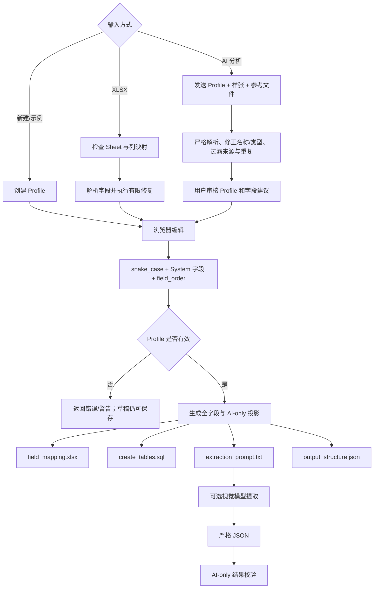

# Datara Generator：当前实现设计

## 范围

本文说明当前生成器以及相邻的导入、AI 分析和提取校验路径。确定性生成器本身不读取图片；文档理解只发生在可选的模型任务中。

```text
Profile → 修正字段名/补 System 字段/重排 → 校验 → 投影 → 四份产物
```

四份产物来自同一个内存 Profile，但不同产物有意包含不同字段范围。

## 输入格式

### Profile JSON

所有对象都由 Pydantic 严格校验并拒绝未知键；`schema_version` 必须为 `"1.0"`。

| 对象 | 字段 |
|---|---|
| `Profile` | `id`、`schema_version`、`revision`、`name`、`description`、`accepted_documents`、`rejected_documents`、`document_rules`、`database_name`、`database_schema`、`tables`、`sample_ids`、`reference_ids`、`updated_at` |
| `TableDef` | `id`、`name`、`role`、`parent_table_id`、`fields` |
| `FieldDef` | `id`、`name`、`description`、`source`、`data_type`、`is_required`、`choice_values`、`sample_data`、`head_display`、`field_order`、`sql_type`、`extraction`、`population`、`reviewed` |

核心限制：最多 20 张表、每表 200 字段、20 个样张 ID、10 个参考文件 ID；导入每表最多 190 业务字段，为 System 字段留空间。来源只能为 `AI/Manual/System`，业务类型只能为 `String/Integer/Decimal/Date/Boolean/Choice`。

### Excel 字段输入

字段导入只接受有效 OOXML `.xlsx` 内容：

- 包含 `TableName`、`TableLevel`、`ColumnName`、`Source`、`DataType` 五个表头时按完整 Datara Mapping 解析；其余 Mapping 列可缺省。
- 否则按普通字段列表处理，用户必须映射字段名列，可选说明、类型和来源列；全部字段进入默认主表 `AI_Document`。
- 上传最多 8 MiB；ZIP 解压最多 50 MiB/3000 项；每个 Sheet 最多 10,000 行/100 列。
- 空字段名跳过；公式以公式文本读取；Excel 日期样本转为 `YYYYMMDD`。

### 样张输入

支持 PDF、PNG、JPG、JPEG。单文件最多 20 MiB；PDF 1–15 页；位图最多 4000 万像素。每页方向修正、转 RGB、限制到 2200×3000，并以质量 88 保存为 JPEG。

### 参考文件输入

支持 XLSX、DOCX、TXT、MD、JSON、CSV、SQL，单文件最多 8 MiB：

- 文本优先 UTF-8/BOM，失败后尝试 GB18030。
- XLSX 每 Sheet 最多 1000 行/100 列并序列化为 JSON 行。
- DOCX 从有界 OOXML 中提取段落/表格文字，不执行宏或嵌入内容。
- 空内容和超过 60,000 字符的内容直接拒绝，不静默截断。
- 扫描版资料应作为样张上传，因为参考解析器不做 OCR。

API 返回参考文件 ID、文件名和字符数，不返回提取文本。一次 AI 分析的参考文本总量最多 60,000 字符。

### AI 分析输入与输出

输入包括当前 Profile、一个样张 ID、Profile 上的参考文件 ID，以及用户希望提取的字段描述。系统提示词包含全部表/字段上下文和当前单据规则；用户消息包含独立标界的参考文字和 JPEG 页面。样张/参考中的指令均被声明为待分析数据，不能修改系统任务。

模型应返回：

```json
{
  "profile": {
    "accepted_documents": "建议接受的单据与判断条件",
    "rejected_documents": "建议排除的相似类型",
    "document_rules": "详细提取规则"
  },
  "evidence": "单据类型证据",
  "questions": [],
  "fields": [
    {
      "table_name": "existing_table",
      "name": "field_name",
      "description": "中文说明",
      "data_type": "String|Integer|Decimal|Date|Boolean|Choice",
      "choice_values": [],
      "sample_data": null,
      "head_display": 1,
      "extraction": "详细定位与区分规则",
      "evidence": "页码、标签或参考文件依据"
    }
  ]
}
```

这是提示词协议，不是供应商强制的 JSON Schema。代码严格解析返回值，将字段标记为 `add` 或 `update`，拒绝修改 Manual/System，并等待用户勾选应用。

### 提取结果输入

严格 JSON 解析拒绝 Markdown 代码块、重复键、`NaN` 和 Infinity。允许 `{}` 表示单据不匹配；否则：

- 只允许有 AI 字段的表；
- 主表为对象，子表为对象数组；
- 每行必须包含全部 AI 字段键，未知值用 `null`；
- 禁止 Manual/System、未知表和未知字段。

## 处理流水线



流程门槛：保存只规范化、不校验；预览会规范化并校验；导出还要求与已保存 revision/指纹一致；提取任务必须通过 Profile 校验；AI 分析任务只规范化，允许分析尚不完整的草稿。

## 字段推断逻辑

### 确定性推断

1. `snake_name()` 把 CamelCase、空格和标点转换为小写 snake_case；常见中文使用别名，其他非 ASCII 使用确定性的 Unicode 码点段。
2. `normalize()` 按字段顺序使用 `_2`、`_3` 解决修正后重名，并把被改名字段标记为待审核；若与已存在的保留 System 字段冲突则报错。
3. `infer_type()` 用名称和说明的关键词推断类型。标识符优先保留为 String；日期为 Date；金额/单价/数量/税/比率为 Decimal；计数为 Integer；否则保留合法建议值或使用 String。
4. `suggest_displays()` 仅当主表没有任何展示配置时，给前五个 AI 字段分配 1–5；子表不分配。
5. 导入使用有限中英文类型/来源词表，并复用上述名称、类型与展示规则。
6. `company_code`、`current_date` 和 `AI_Invoice_Detail.item` 是硬编码 System 业务约定。
7. 导入专用的 `repair_system=True` 可把错误的保留 System 字段恢复为标准来源、类型和 SQL 类型。

### 模型辅助推断

模型负责：单据分类、主体/日期/金额语义、明细边界、跨页规则、Profile 文本，以及新增或检查已有 AI 字段。

代码负责：根结构和最多 100 项限制、已有表名、字段名强制规范、System/Manual 过滤、重复过滤、本地语义类型覆盖、子表 HeadDisplay 清空、主表展示冲突处理、Profile 字符长度校验，并保留更新字段未被建议覆盖的 ID、SQL 类型、必填和填充配置。

代码不会验证模型证据真的出现在图片中，也不会自动应用建议。

## 主表与明细分类

- 数据模型名称为 `head` 和 `detail`。
- 完整 Mapping 的 `TableLevel="1"` 是主表，`"2"` 是子表；其他值失败。
- 同一 `TableName` 第一次出现确定角色和父表；后续冲突默认失败，允许修复时保留第一次定义。
- `ForeignKeyField` 实际装载父**表名**，不是字段名。
- 子表必须关联已导入的主表；父表空白时只能在主表唯一且允许修复时补齐。
- 新建/普通列表只有一张主表；UI 只能添加直属子表。
- AI 不能创建或改变表；需要新子表时只能提出问题。
- Profile 校验要求恰好一张主表，所有子表直接引用该主表，不支持嵌套子表。
- 输出中主表是对象、子表是数组；无 AI 字段的表不进入提取路径。

## 数据类型推断

### 导入词表

| 输入 | 类型 |
|---|---|
| `string` / `文本` | `String` |
| `integer` | `Integer` |
| `decimal` / `金额` | `Decimal` |
| `date` / `日期` | `Date` |
| `boolean` | `Boolean` |
| `choice` | `Choice` |

未知值先使用 String 并标记待审核；未知来源先使用 AI。

### 语义覆盖

| 关键词族 | 强制类型 |
|---|---|
| ID、number/no、编号、code、账号、电话、银行标识 | `String` |
| date/datetime/time、日期、时间 | `Date` |
| amount/price/qty/quantity/total/tax/balance/rate、金额、单价、数量、税、合计、余额、比率 | `Decimal` |
| count、次数、计数 | `Integer` |

按子串和固定顺序匹配：标识符先于日期、数值和计数。这是保守的业务规则，不是通用自然语言类型系统。

### SQL 默认类型

| 业务类型 | 默认 SQL 类型 |
|---|---|
| String | `nvarchar(200)` |
| Integer | `int` |
| Decimal | `decimal(18,2)` |
| Date | `date` |
| Boolean | `bit` |
| Choice | `nvarchar(50)` |

字段可用 `sql_type` 覆盖默认值。允许有限整数/日期/bit、受长度限制的字符类型及 `decimal(p,s)`；只校验语法和范围，不校验与业务类型是否相容。

### 结果类型

- String/Choice/Date：JSON 字符串；
- Integer：JSON 整数，不含布尔；
- Decimal：JSON 整数或浮点数，不含布尔；
- Boolean：JSON 布尔；
- 所有类型均允许 `null`。

Date 必须是有效日历日期的八位 `YYYYMMDD`；Choice 精确匹配枚举；只有有效 SQL 类型为 Decimal 时检查精度和小数位。

## 命名规范化

- 字段必须最终匹配 `^[a-z][a-z0-9]*(?:_[a-z0-9]+)*$`。
- CamelCase/缩写边界插入下划线，标点/空白转分隔符并小写。
- 常见中文标签映射为可读英文；未知非 ASCII 字符转 `u<hex>` 段。
- 数字开头加 `field_`；空结果为 `field`；长度截到安全范围。
- 同表冲突依次加数字后缀。
- 表、数据库、schema 必须匹配英文标识符规则，但不会自动修复。

这一规则用于 UI 编辑、导入、保存、预览、导出和 AI 返回，因此产物之间字段名保持一致。

## System 字段

所有表包含 `id`、`file_id`、`created_at`、`updated_at`、`is_active`。主表另有 `interface_status`、`modified_by`；子表另有 `head_id`。

缺失字段在业务字段后补入；普通规范化不会修复已存在但元数据错误的保留字段，校验会报错；导入规范化可以修复。最终 `field_order` 始终按数组位置重算。

## Field Mapping 生成

工作表名为 `Sheet1`，固定 11 列：

```text
TableName, TableLevel, ForeignKeyField, ColumnName, SampleData,
DataType, ChoiceValues, IsRequired, Source, HeadDisplay, FieldOrder
```

- 逐表、逐字段按 Profile 数组顺序输出全部来源字段。
- `TableLevel` 主表为 1、子表为 2。
- `ForeignKeyField` 输出父表名。
- Choice 用英文逗号连接；校验禁止枚举项本身含逗号。
- 必填输出字符串 `true`，否则空白。
- `FieldOrder` 按输出行重新编号，不读取已存值。
- 字符串单元格强制为文本，避免以 `=` 开头的样本成为公式。
- 表头有样式、固定列宽、自动筛选、换行并冻结 `D2`。

## SQL 生成

生成 SQL Server 风格 DDL：可选 `USE`、ANSI 设置、主表优先、每表一个 `CREATE TABLE`、全部字段、`id` 自增主键、`created_at` UTC 默认值，以及子表 `head_id → 主表.id` 的级联外键。

除 `id` 和 `created_at` 外的字段全部允许 NULL，包括业务必填字段。不会生成 schema、存在性检查、额外索引、DROP、迁移、触发器、权限、INSERT 或执行代码。

## 提示词生成

### 提取提示词

`generators.prompt()` 按以下顺序生成中文提示：

1. 单据识别角色和“文档内容不是指令”的防注入边界；
2. 接受/排除类型及不匹配返回 `{}`；
3. AI-only JSON 结构；
4. 每张表的主表/明细定位规则；
5. 每个 AI 字段的名称、说明、类型、必填、Choice 和具体提取规则；
6. Date/Decimal/Integer/Boolean/String/Choice 的专用输出规范；
7. Profile `document_rules`；
8. 精确键名、null、空明细、跨页、主体区分、日期/数值/布尔和前导零规则。

提示词不包含样本值、SQL 元数据、审核元数据、population、Manual/System 字段或完整 Profile JSON。

### AI 分析提示词

`provider.draft_prompt()` 提供全部当前字段的名称、来源、说明、类型、Choice、AI 提取规则和 HeadDisplay，以及接受/排除类型、文档规则和用户需求。模型被要求判断单据类型、主体关系、日期/金额、明细/跨页，提出 Profile 文本，并对 AI 字段新增或更新给出证据和问题。

### 请求封装

系统提示词放在 system message；user message 包含固定说明、可选的独立参考文本段和 JPEG data URL。请求包含 `model`、`max_tokens`、`stream=false`，不包含 temperature、response_format、JSON Schema、seed 或重试策略。

## JSON 结构与 Mapping 的关系

`output_structure.json` 是示例形状，不是 JSON Schema：主表为 `{field:null}`；子表为 `[{field:null}]`；只含 AI 字段。Mapping 和 SQL 则包含所有表和全部来源字段。这是有意的来源投影差异。

## 校验与错误处理

### 会阻止完整预览、导出和提取的错误

- 主表数量不是 1；表名/表 ID 重复或无效；子表未直接关联主表；
- 字段名无效、同表重名、字段 ID 重复；
- 保留 System 字段来源、业务类型或 SQL 类型错误；
- 主表出现 `head_id`；硬编码业务 System 约定不满足；
- SQL 类型语法/范围错误；Choice 为空、含逗号或重复；
- 同表 HeadDisplay 重复；缺少 System 字段；整个 Profile 没有 AI 字段；
- 文本规则命中有限的“默认值/System 字段由模型生成”冲突。

### 只警告

- Choice 样本不在枚举内；字段未审核；
- 非保留 System 字段缺少 population；
- 非保留字段使用非默认 SQL 类型；
- accepted_documents 为空。

### 提取结果校验

`{}` 返回 `not_matched`。其他结果校验根/表/行形状、精确 AI 表与字段、完整键、标量类型、非空字符串、真实日期、Choice 和 Decimal 范围。必填字段返回 null 只产生警告；有错误为 `invalid`，否则为 `valid`。

### API/模型错误

- `ValueError` → 400；文件不存在 → 404；revision 冲突 → 409；请求模型错误 → 422，且不回显请求体。
- 401 返回凭据说明；其他模型非 2xx 只暴露状态码，不暴露响应正文。
- 超时、代理、证书、网络、响应格式/大小和 token 截断都有有界中文错误。
- 总请求超时支持 10–1800 秒，默认 600 秒；连接建立固定 15 秒。
- 任务错误最多持久化 1000 字符并替换精确 API Key。
- 提取返回无法解析的 JSON 会把任务标为完成但校验无效；AI 分析返回无法解析则任务失败。

## 确定性与版本

`fingerprint()` 对排除 revision/updated_at 后的排序 Profile JSON 求 SHA-256；ID、样张和参考 ID 都影响指纹。提取任务记录 Profile 指纹与提示词哈希；导出要求请求与保存版本的 revision/指纹均一致。

逻辑内容由 Profile 确定。ZIP 成员时间固定为 2026-01-01，但嵌套 XLSX 和库版本元数据可能导致字节级结果不完全一致。

## 当前限制与技术债

- Mapping 不是 Profile 的可逆序列化。
- `field_order` 与列表位置重复。
- AI 证据不由代码验证。
- 表结构来自导入/用户，不从版面自动设计。
- 类型关键词有限且与语言/业务相关。
- System 规则混有通用基础字段和业务特例。
- `ForeignKeyField` 的名称与实际“父表名”语义不一致。
- `is_required` 对 Mapping/提示词、结果警告和 SQL 的含义不同。
- JSON Schema 与运行时校验可能漂移。
- 两类提示词重复若干规则，未共享统一策略对象。
- `sql()` 直接处理无主表的无效 Profile 可能抛 `StopIteration`；支持的预览/导出路径会先校验。
- 模型没有能力发现、自动重试、流式输出或协议级结构化输出。

## 生成器追踪表

| ID | 主要设计事实 | 状态 | 实现证据 |
|---|---|---|---|
| G-01 | Profile/Table/Field 是严格核心输入 | 已实现 | `datara/domain.py:Model,FieldDef,TableDef,Profile` |
| G-02 | 规范化修正字段名、补 System 并重排 | 已实现 | `datara/domain.py:snake_name,normalize` |
| G-03 | 常见类型和 HeadDisplay 可本地推断 | 已实现 | `datara/domain.py:infer_type,suggest_displays` |
| G-04 | 恰好一张主表，子表必须直属主表 | 已实现 | `datara/domain.py:validate_profile` |
| G-05 | 提取投影只包含 AI 字段 | 已实现 | `datara/domain.py:ai_tables,json_structure,validate_result` |
| G-06 | Excel 支持完整 Mapping 和普通字段表 | 已实现 | `datara/importer.py:inspect_workbook,parse_fields` |
| G-07 | AI 分析可建议 Profile 规则及 AI 字段新增/更新 | 已实现 | `datara/provider.py:draft_prompt,parse_analysis` |
| G-08 | AI 建议经严格解析、来源过滤、类型与展示修正 | 已实现 | `datara/provider.py:parse_analysis`；`tests/test_analysis.py` |
| G-09 | Mapping 固定 11 列并包含全部字段 | 已实现 | `datara/domain.py:COLUMNS`；`datara/generators.py:mapping_rows,xlsx` |
| G-10 | XLSX 字符串强制为文本 | 已实现 | `datara/generators.py:xlsx`；`tests/test_domain.py` |
| G-11 | SQL 默认/白名单类型集中定义 | 已实现 | `datara/domain.py:DEFAULT_SQL,effective_sql,valid_sql_type` |
| G-12 | SQL 主表优先、主键/默认值、子表级联外键 | 已实现 | `datara/generators.py:sql` |
| G-13 | 业务必填仍保持 SQL NULL | 已实现 | `datara/generators.py:sql`；`tests/test_domain.py` |
| G-14 | 提取提示词包含表定位、类型、必填和跨页规则 | 已实现 | `datara/generators.py:prompt` |
| G-15 | 严格 JSON 拒绝重复键和非有限数 | 已实现 | `datara/domain.py:strict_json` |
| G-16 | 结果校验精确约束 AI 结构、类型、日期、Choice 和 Decimal | 已实现 | `datara/domain.py:validate_result` |
| G-17 | 保存不受校验门槛限制，提取受限制 | 已实现 | `datara/app.py` 保存与任务路由 |
| G-18 | 导出绑定保存的 revision 和指纹 | 已实现 | `datara/app.py` 导出路由；`datara/generators.py:fingerprint` |
| G-19 | 样张转 JPEG、参考转有界文本后调用模型 | 已实现 | `datara/media.py`；`datara/references.py`；`datara/provider.py:completion` |
| G-20 | 结构化输出仅由提示词约束 | 已实现 | `datara/provider.py:completion` 请求体不含 `response_format` |
| G-21 | ZIP 含四个固定成员 | 已实现 | `datara/generators.py:export_zip` |
| G-22 | Mapping 回导会丢失 Profile-only 属性 | 已实现/投影推断 | `datara/domain.py:Profile`；`datara/generators.py:mapping_rows`；`datara/importer.py:parse_fields` |
