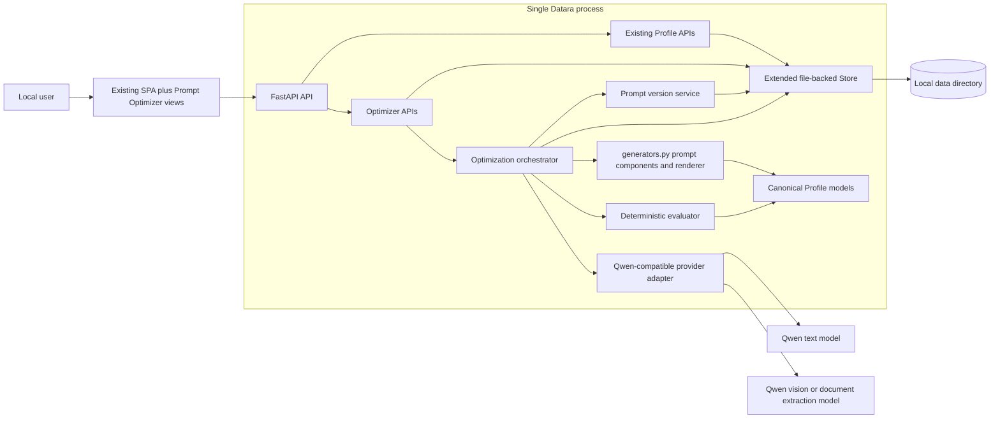
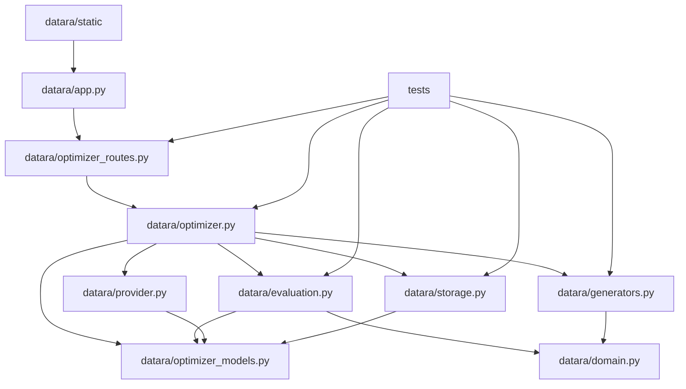
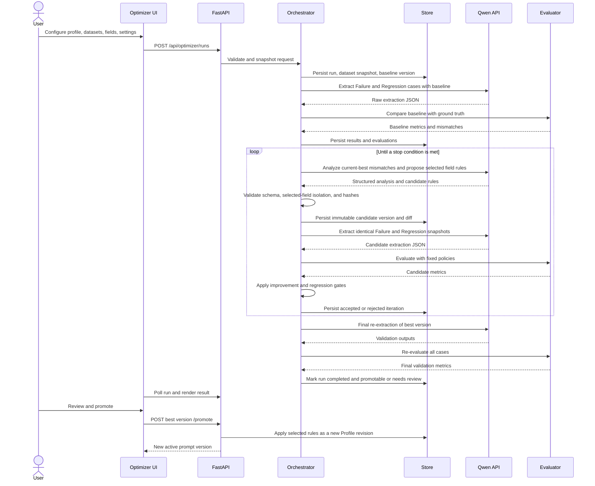
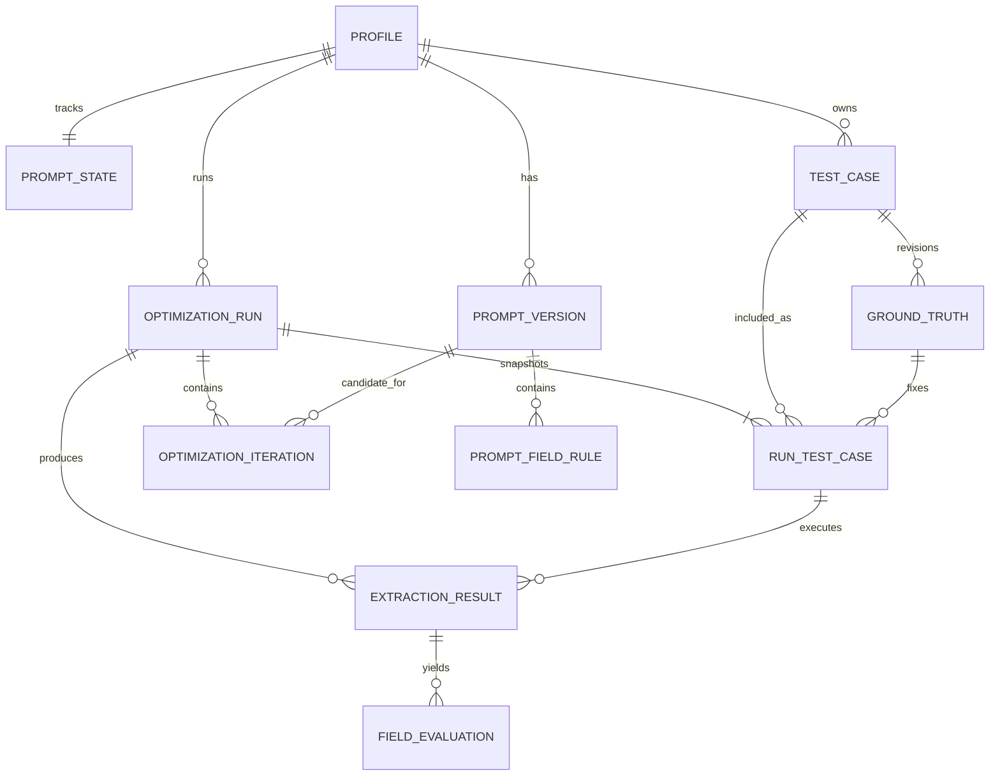

# Datara Profile Generator — Prompt Optimizer V1 Design

**Status:** V1 implementation specification; core workflow implemented

**Audience:** Product, engineering, QA, and Codex implementation agents

**Applies to:** The current local-first, single-process Datara Profile Generator

## 1. Final recommendation / design conclusion

Add Prompt Optimizer as an integrated module in the existing FastAPI process and vanilla-JavaScript SPA. Keep `Profile` as the canonical active definition, keep all artifact rendering in `datara/generators.py`, reuse the existing sample renderer and OpenAI-compatible Qwen connection, and persist optimizer records as atomic local JSON files through `Store`.

V1 must be a deterministic application-controlled state machine, not an autonomous agent. Qwen proposes structured error analyses and replacement rules and performs document extraction. Application code owns candidate construction, selected-field isolation, execution order, comparison, scoring, acceptance, stopping, version selection, promotion, and rollback.

The implementation should make these guarantees:

1. A candidate can change only the `extraction` text of explicitly selected `Source=AI` fields. Global rules, profile rules, field metadata, table structure, SQL, Mapping, and unselected rules are byte-for-byte unchanged.
2. Every candidate is evaluated on the same immutable Failure Set snapshot and, when supplied, the same immutable Regression Set snapshot.
3. A candidate is accepted only when Failure Set target accuracy improves by the configured threshold and any supplied Regression Set remains within its guardrail. The default allowed regression drop is zero percentage points.
4. The result of a run is the highest-ranked accepted version across all iterations, with the baseline retained when no candidate is better. The last iteration has no special status.
5. The best version receives a final validation pass and remains a non-active candidate until a user explicitly promotes it.
6. Promotion and rollback create new Profile revisions. Rollback never rewinds or mutates history.

This extends the lifecycle to **Generate → Test → Optimize → Validate → Publish**, where “Publish” in V1 means **promote the validated prompt to the active local Profile**. Datara deployment remains out of scope.

## 2. Table of contents

1. [Final recommendation / design conclusion](#1-final-recommendation--design-conclusion)
2. [Table of contents](#2-table-of-contents)
3. [Architecture overview](#3-architecture-overview)
4. [Scope and design principles](#4-scope-and-design-principles)
5. [Functional design](#5-functional-design)
6. [Optimization workflow](#6-optimization-workflow)
7. [Prompt architecture](#7-prompt-architecture)
8. [Evaluation mechanism](#8-evaluation-mechanism)
9. [Data model](#9-data-model)
10. [Backend/API design](#10-backendapi-design)
11. [Frontend design](#11-frontend-design)
12. [Qwen integration](#12-qwen-integration)
13. [Version management](#13-version-management)
14. [Error handling](#14-error-handling)
15. [Security considerations](#15-security-considerations)
16. [Testing strategy](#16-testing-strategy)
17. [Implementation tasks](#17-implementation-tasks)
18. [Future roadmap](#18-future-roadmap)

## 3. Architecture overview

### 3.1 Existing architecture constraints

The current repository implements:

- one Uvicorn/FastAPI process serving API routes and a static HTML/CSS/JavaScript SPA;
- `Profile` as the canonical field and rule definition;
- deterministic Mapping, SQL, extraction prompt, and output structure generation in `datara/generators.py`;
- local atomic JSON records under `DATARA_DATA_DIR`;
- in-memory `asyncio` model tasks with persisted status snapshots;
- PDF/image rendering to bounded JPEG pages;
- one OpenAI-compatible `/chat/completions` provider adapter;
- optimistic Profile revision checks and content fingerprints;
- strict JSON parsing and AI-only result-structure validation.

Prompt Optimizer should extend these boundaries rather than replace them. In particular, it must not add a second web app, a general-purpose agent runtime, a task broker, a database server, or a second artifact generator.

### 3.2 Logical architecture



### 3.3 Module / component structure



`optimizer_routes.py` is recommended to avoid making the already central `app.py` harder to maintain. `create_app()` should register the router with injected access to the existing Store, connection state, API-key accessor, and task registry.

### 3.4 V1 persistence choice

Use the existing file store in V1. The entities in section 9 are a logical database model implemented as typed JSON records with stable IDs, foreign-key-like identifiers, direct profile-state records, and atomic writes. This preserves local-first installation and avoids a migration to SQLite or a server database solely for one module.

The V1 limitation is that multi-record writes are not a true database transaction. Promotion therefore uses a small write-ahead promotion record and recovery procedure described in section 13. A later SQLite migration can preserve the same logical entity model and API contracts.

## 4. Scope and design principles

### 4.1 V1 in scope

- Select an existing Profile and either use its generated prompt or import an already-published prompt as the baseline by paste or TXT/MD upload.
- Associate multiple existing/uploaded PDF or image samples with the required Failure dataset and optional Regression dataset.
- Enter or upload ground truth in the existing AI-only JSON structure.
- Select one or more `Source=AI` fields for optimization.
- Configure comparison modes, maximum iterations, early stopping, minimum improvement, and regression tolerance.
- Run baseline extraction across both datasets.
- Ask Qwen for structured error analysis and candidate field-rule replacements.
- Enforce field isolation before any candidate execution.
- Execute candidates, evaluate field values, calculate scores, and accept or reject iterations.
- Stop at target accuracy, plateau, unchanged output, cancellation, unrecoverable failure, or maximum iterations.
- Show iteration progress, errors, scores, diffs, fixed cases, and remaining failures.
- Persist immutable versions, analyses, extraction evidence, evaluation evidence, and run configuration.
- Final validation, explicit promotion, version comparison, and rollback.

### 4.2 V1 non-goals

- Autonomous or general-purpose agent behavior.
- OCR diagnosis or repair.
- Field Mapping, type, source, table, SQL, or schema modification.
- Profile redesign or automatic field creation.
- More than one candidate per iteration.
- Production self-learning, background promotion, or promotion without review.
- Direct deployment to Datara, SQL execution, or changes to the generated artifact contract.
- Cross-process workers, resumable jobs, shared storage, authentication, or multi-user collaboration.

### 4.3 Design principles

| Principle | V1 rule |
|---|---|
| Application control | A fixed state machine invokes Qwen at declared steps; Qwen cannot choose tools or mutate state. |
| Canonical Profile | Active rules remain in `Profile.tables[].fields[].extraction`; versions are immutable snapshots and audit records. |
| Least mutation | Only selected field extraction rules can differ in a candidate. |
| Reproducible evidence | Run configuration, dataset membership, document hashes, model IDs, prompt hashes, raw responses, normalization policy, and scores are persisted. |
| Fair comparison | Baseline and every candidate use the same dataset snapshot and evaluation policy. |
| Regression first | A failure improvement cannot bypass the regression guardrail. |
| Human release gate | Optimization may select a best candidate but cannot make it active automatically. |
| Fail closed | Missing ground truth, incomplete candidate evaluation, structural output failure, or stale Profile state cannot pass validation. |
| Compatible extension | Existing Profile edit, preview, extraction test, and export behavior continue to work. |

## 5. Functional design

### 5.1 Error Case Management

A Test Case associates one stored sample with a dataset role and one active ground-truth revision. A sample may appear only once in a given run snapshot. The same sample may be reused in later runs.

Required operations:

- add a sample using the current `/api/samples` upload flow;
- classify it as `failure` or `regression`;
- enable, disable, rename, or remove the association without deleting the underlying sample;
- show page count, upload name, content hash, ground-truth coverage, and last extraction status;
- block run creation when the enabled Failure dataset is empty;
- require complete expected values for all selected fields on Failure cases;
- require complete expected values for every AI field on Regression cases by default.

“Complete” means the ground-truth JSON contains the required table and field paths. Expected `null` is a legitimate value and is different from an absent ground-truth path.

### 5.2 Ground Truth

Ground truth uses the Profile’s AI-only JSON shape. It can be entered in a JSON editor or uploaded as one JSON file per case. The backend must:

1. parse it with `strict_json()`;
2. validate table and field names against the snapshotted Profile;
3. validate values with ground-truth-aware type validation;
4. preserve the raw expected form used for exact matching;
5. report missing coverage separately from an expected `null`;
6. create a new immutable GroundTruth revision when edited.

Failure-case ground truth may be a partial AI-only projection, but it must include every selected field instance that is scored. Its table containers and supplied field names must still match the Profile. When Regression cases are supplied, their ground truth must be the complete AI-only projection by default so `R_all` has a valid denominator. This uses a dedicated ground-truth validator; the existing `validate_result()` remains strict for model extraction output and is not weakened.

Ground truth may use accepted alternate date and numeric formats only when the field uses normalized comparison. The normalizer, not `validate_result()`, decides whether such an expected value is valid.

### 5.3 Field Selection

Only fields meeting all of these conditions are selectable:

- the field exists in the baseline Profile;
- `source == "AI"`;
- it is not a reserved or Datara-populated field;
- it has a stable field ID;
- every enabled Failure case contains ground truth for its path.

The run stores both selected field IDs and their table/field names. IDs are authoritative; names are display snapshots. A field rename, source change, deletion, or table move after run creation makes the run stale and blocks promotion.

### 5.4 Settings

| Setting | Type and default | Rule |
|---|---|---|
| `max_iterations` | integer, default 3, range 1–20 | Hard candidate-generation limit. The smaller default avoids unexpectedly expensive first runs; users may still raise it to 10 or more. |
| `early_stop_enabled` | boolean, default true | Enables plateau and target stops. |
| `no_improvement_limit` | integer, default 2, range 1–10 | Consecutive non-accepted iterations before stopping. |
| `minimum_improvement` | ratio, default 0.01, range 0–1 | Minimum Failure target-accuracy gain over the current best; 0.01 is one percentage point. |
| `target_accuracy` | decimal, default 1.0, range 0–1 | Stop after a candidate reaches the target and passes regression. |
| `max_regression_drop` | ratio, default 0.0, range 0–0.05 | Explicit guardrail; changing from zero requires a warning and is persisted. |
| `semantic_threshold` | decimal, default 0.90 | Used only by explicitly semantic fields. |
| `final_validation_rerun` | boolean, default true and locked in V1 | Re-executes the best candidate before it becomes promotable. |
| `reuse_baseline_results` | boolean, default true | Reuses a structurally valid extraction from the same endpoint, model, prompt hash, JSON structure, and document hash for up to 24 hours. Candidate and final-validation calls are never cached. |

All percentage calculations use exact integer counts internally. Display percentages are rounded only in the UI.

### 5.5 Result contract

Every completed run returns:

- baseline version and score summary;
- best version and best iteration, or baseline if no improvement passed;
- stop condition;
- accepted and rejected iteration list;
- Failure selected-field score;
- Regression all-field score and selected-field score;
- fixed and regressed field paths by case;
- remaining mismatches;
- per-version diffs and reasons;
- final-validation status;
- promotion eligibility and any blocking reasons.

## 6. Optimization workflow

### 6.1 State machine

An `OptimizationRun.status` is one of:

`queued → baselining → optimizing → validating → completed`

Terminal alternatives are `failed`, `cancelled`, and `interrupted`. `completed` does not imply promoted. The run separately records `promotion_eligible`.

Each `OptimizationIteration.status` is one of `analyzing`, `evaluating`, `accepted`, `rejected`, or `failed`.

### 6.2 Prompt optimization sequence



### 6.3 Detailed algorithm

1. Reload the persisted Profile; reject unsaved UI state.
2. Normalize and validate the Profile using existing rules.
3. Resolve the current active prompt version by rendered prompt hash. If none matches, create a `manual_edit` baseline version.
4. Snapshot Profile revision/fingerprint, prompt components, test-case IDs, ground-truth revision IDs, document hashes, selected field IDs, comparison policies, settings, and model configuration without the API key.
5. Validate Failure and Regression dataset coverage.
6. Run baseline extraction on every enabled case. Calls may be sequential in V1 to honor provider rate limits and make cancellation predictable.
7. Parse and structurally validate each result; persist the raw response and validation outcome.
8. Evaluate every covered AI field. Calculate baseline metrics.
9. Set `best_version_id` to the baseline and `best_metrics` to baseline metrics.
10. For each iteration:
    1. Build a bounded error bundle from mismatches produced by the current best version.
    2. Ask the Qwen text model for error analyses plus one replacement rule per field it proposes to change.
    3. Strictly parse the response and reject references to unselected fields.
    4. Construct the candidate in application code by copying the best prompt components and replacing only returned selected field rules.
    5. Compare all immutable component hashes. Reject the candidate if any non-selected component changed.
    6. Stop with `unchanged_prompt` if every returned rule equals the best rule after newline normalization.
    7. Evaluate the candidate on the exact same dataset snapshot.
    8. Accept only if the acceptance gate passes; otherwise persist rejection and increment the no-improvement count.
    9. When accepted, update `best_version_id`, reset the no-improvement count, and continue from the accepted best.
    10. Evaluate stop conditions in the order in section 6.4.
11. Re-run the best candidate across both datasets for final validation. Do not reuse iteration extraction results for this pass.
12. Mark the run promotable only when final validation passes the same regression guardrail, field isolation is intact, and the Profile is not stale.

Rejected candidates are never used as the base for the next iteration. They remain visible for traceability.

### 6.4 Stop conditions and precedence

Check stop conditions after an evaluated iteration in this order:

1. `cancelled` — a user requested cancellation;
2. `target_accuracy` — target Failure selected-field accuracy reached and regression guardrail passed;
3. `unchanged_prompt` — Qwen returned no effective selected-rule change;
4. `no_improvement` — configured consecutive rejected/non-improving rounds reached;
5. `max_iterations` — iteration limit reached.

Infrastructure and invalid-contract failures stop with `failed`, not a normal early-stop reason. The record still exposes the best version found so far, but it is not promotable until a complete validation run succeeds.

### 6.5 Acceptance and best-version ranking

Let:

- `F(v)` be matched selected field instances divided by comparable selected field instances in the Failure Set;
- `R_all(v)` be matched covered AI field instances divided by all covered AI field instances in the Regression Set;
- `R_sel(v)` be the equivalent Regression Set metric for selected fields;
- `best` be the current accepted best version.

A candidate `c` passes only when:

```text
F(c) - F(best) >= minimum_improvement
and R_all(c) >= R_all(baseline) - max_regression_drop
and every case completed evaluation
and the selected-field isolation check passed
```

The regression guardrail is anchored to the baseline, not the previous iteration, so small losses cannot accumulate. `R_sel` is reported but is not a substitute for `R_all`.

If multiple accepted versions have equal `F`, rank them by:

1. higher `R_all`;
2. higher `R_sel`;
3. fewer total changed characters from the baseline selected rules;
4. earlier iteration.

## 7. Prompt architecture

### 7.1 Component model

Refactor `generators.prompt(profile)` internally without changing its public behavior. Add a deterministic component builder and renderer in `datara/generators.py`:

```python
prompt_components(profile: Profile) -> PromptComponents
render_prompt(components: PromptComponents) -> str
prompt(profile: Profile) -> str
```

`PromptComponents` contains:

| Level | Source | Mutability in optimizer V1 |
|---|---|---|
| Global extraction rules | Code-owned constants and AI-only JSON protocol | Immutable |
| Profile-level rules | `accepted_documents`, `rejected_documents`, `document_rules` | Immutable within a run |
| Field-level rules | Stable field identity, description, type-derived rules, and `FieldDef.extraction` | Only selected `FieldDef.extraction` text may change |

The JSON schema/shape, table ordering, field ordering, type rules, null policy, date format, and document-match behavior remain code-owned. A candidate never supplies an entire rendered prompt.

For an imported published prompt, the version stores the imported text as an immutable `imported_prompt_base`. The optimizer never reparses or rewrites that body. It renders a candidate by preserving the body byte-for-byte and appending one clearly marked, higher-priority **selected field overrides** block. Later iterations replace only entries in that block. This gives existing deployments a usable baseline without pretending the application can safely reconstruct their custom global/profile instructions.

### 7.2 Candidate output contract

The Qwen analyzer must return one strict JSON object:

```json
{
  "analyses": [
    {
      "field_id": "stable-field-id",
      "table_name": "AI_Invoice_Head",
      "field_name": "invoice_number",
      "error_type": "wrong_region",
      "root_cause": "The rule does not prioritize the invoice header.",
      "evidence": ["case-123: expected INV-7, extracted REF-9"],
      "suggested_change": "Prioritize invoice-number labels in the header."
    }
  ],
  "candidate_rules": [
    {
      "field_id": "stable-field-id",
      "old_rule_hash": "sha256-hex",
      "new_rule": "Extract the value adjacent to Invoice No...",
      "reason": "Disambiguates the header value from footer references."
    }
  ]
}
```

Allowed `error_type` values are:

`missing_value`, `wrong_region`, `label_confusion`, `formatting`, `multiple_candidates`, `table_alignment`, `document_boundary`, `unsupported_pattern`, and `unknown`.

The parser rejects unknown properties, unknown fields, duplicate field IDs, rule text over 5,000 characters, stale old-rule hashes, empty changed rules, and attempts to address System/Manual/unselected fields. Analyses are stored even when their corresponding candidate is later rejected.

### 7.3 Isolation invariant

Candidate construction must be a pure application function:

```text
candidate = deep_copy(best_components)
for each validated candidate_rule:
    candidate.field_rules[field_id].extraction = new_rule
```

Before extraction, assert:

- global component hash is unchanged;
- profile component hash is unchanged;
- table and field sequence is unchanged;
- JSON structure hash is unchanged;
- every unselected field component hash is unchanged;
- each changed ID belongs to the selected set;
- the rendered candidate passes existing Profile/prompt conflict validation.

This invariant is tested at both service and API levels and rechecked at promotion.

### 7.4 Diff generation

Generate diffs in application code with `difflib.unified_diff`; never ask Qwen to author the diff. Store:

- old and new rule text;
- line-level unified diff;
- analyzer reason and root cause;
- before/after Failure selected accuracy;
- before/after Regression all-field accuracy.

## 8. Evaluation mechanism

### 8.1 Evaluation unit

The smallest scored unit is a `FieldEvaluation` identified by:

```text
test_case_id + table_id + field_id + row_index
```

For a head table, `row_index` is `null`. For detail tables, V1 compares rows in document order and uses zero-based `row_index`. A missing expected or actual row creates mismatches for each covered field at that index. Reordering-insensitive line matching is deferred because guessing row identity can create false passes.

### 8.2 Default comparison policy

| Field type | Default | Behavior |
|---|---|---|
| `String` | exact | JSON string equality, including case and internal whitespace. |
| `Choice` | exact | Exact configured choice equality. |
| `Boolean` | exact | Exact JSON boolean equality. |
| `Date` | normalized | Parse allowed date forms to a real calendar date and compare `YYYYMMDD`. |
| `Integer` | normalized | Parse canonical integer text/number using `Decimal`; reject fractional values. |
| `Decimal` | normalized | Parse to `Decimal`, ignore configured grouping separators and insignificant trailing zeros. |

`null` matches only `null`. Empty string never matches `null`.

### 8.3 Exact Match

Exact Match compares decoded JSON values and types. Therefore `"1000"` is not equal to `1000`, `"HKD"` is not equal to `"hkd"`, and leading zeros remain significant for identifier strings.

### 8.4 Normalized Match

Normalization is field-type-specific and deterministic:

- Apply Unicode NFKC before parsing textual dates/numbers.
- Dates accept `YYYYMMDD`, `YYYY-MM-DD`, and `YYYY/MM/DD`. Numeric day-first or month-first forms require an explicit per-field `date_order` of `DMY` or `MDY`; they are never guessed. With `DMY`, `01/09/2026` equals `2026-09-01`.
- Decimal and integer parsing may remove configured grouping separators (default comma and ordinary/non-breaking spaces), remove a configured currency symbol/code, and convert enclosing parentheses to a negative sign. It does not infer multipliers such as “K” or “million”.
- Numeric comparison uses `Decimal`, never binary floating-point equality. Thus `1,000.00` equals `1000`.
- A parse failure is a mismatch with reason `normalization_failed`; it never falls back to loose string comparison.

Store both normalized values and the normalization reason for auditability. Normalizers must be pure functions with no model call.

### 8.5 Optional Semantic Match

Semantic Match is opt-in only for selected `String` fields such as vendor name. It is never a default and cannot be used for identifiers, dates, amounts, choices, or booleans.

The application first applies conservative company-name normalization: NFKC, case-folding, punctuation/whitespace collapse, and a configured legal-suffix dictionary. If values remain different, it sends only the field meaning and the two values to the Qwen text model and requires:

```json
{"equivalent": true, "confidence": 0.96, "reason": "Company legal suffix expansion"}
```

The result is cached by model ID, policy version, field ID, and value-pair hash. It counts as a match only when `equivalent` is true and confidence meets the configured threshold. Provider failure or invalid JSON produces `indeterminate`, which cannot pass candidate evaluation. The UI labels model-assisted matches distinctly.

### 8.6 Structural failures

- Provider success with invalid JSON or invalid AI-only structure is an evaluated extraction failure, not an infrastructure failure. Every covered field in that case is marked mismatched with a structural reason.
- A provider timeout, authentication error, rate-limit exhaustion, or transport failure is an infrastructure failure. The iteration is incomplete and cannot be compared or accepted.
- A `{}` result is valid only as “document not matched.” For a test case with non-empty ground truth, it produces mismatches for all covered fields.

### 8.7 Metrics

Persist integer numerator and denominator plus an unrounded decimal ratio for:

- Failure Set selected fields — primary objective;
- Failure Set all covered AI fields — diagnostic;
- Regression Set selected fields — diagnostic guardrail;
- Regression Set all covered AI fields — release guardrail;
- per field, per case, and overall;
- structural validity rate;
- ground-truth coverage rate.

No weighted average is used in V1: every comparable field instance has weight 1. This makes score changes explainable. A future version may add reviewed weights as a new policy version.

## 9. Data model

### 9.1 Data model diagram



### 9.2 Entity definitions

All IDs are UUID strings; timestamps are UTC ISO-8601 strings. Every record includes `schema_version`, initially `"1.0"`.

#### Existing `Profile`

No new optimizer configuration is added to the Profile in V1. Its current rule locations remain authoritative:

- global rules: code-owned in `generators.py`;
- profile rules: `accepted_documents`, `rejected_documents`, `document_rules`;
- field rule: `FieldDef.extraction`.

#### `PromptState`

One record per Profile at `optimizer/prompt_states/{profile_id}.json`.

| Field | Purpose |
|---|---|
| `profile_id` | Primary key and Profile reference. |
| `active_prompt_version_id` | Active immutable version. |
| `active_prompt_hash` | Rendered prompt SHA-256. |
| `active_profile_revision` | Profile revision holding the active rules. |
| `next_version_number` | Monotonic per-Profile sequence protected by `Store.lock`. |
| `updated_at` | Last reconciliation or promotion. |

#### `PromptVersion`

Stored at `optimizer/prompt_versions/{id}.json`.

| Field | Purpose |
|---|---|
| `id`, `profile_id`, `version_number` | Identity and display sequence. Unique `(profile_id, version_number)`. |
| `parent_version_id` | Version from which this content was derived. |
| `origin` | `manual_edit`, `baseline`, `imported_prompt`, `imported_prompt_refresh`, `optimizer_candidate`, `promotion`, or `rollback`. |
| `lifecycle` | `candidate`, `validated`, `active`, or `superseded`. |
| `profile_revision`, `profile_fingerprint` | Source Profile snapshot. |
| `global_rules_version`, `global_rules_hash` | Code-rule identity. |
| `profile_rules`, `profile_rules_hash` | Immutable accepted/rejected/document rule snapshot. |
| `json_structure_hash`, `field_sequence_hash` | Isolation evidence. |
| `rendered_prompt`, `prompt_hash` | Complete reproducible prompt and SHA-256. |
| `selected_field_ids` | Fields allowed to differ from parent; empty for manual baseline. |
| `optimization_run_id`, `iteration_id` | Optional provenance. |
| `metrics` | Optional immutable evaluation summary. |
| `created_at`, `created_by` | Audit fields; `created_by` is `user` or `optimizer`. |

#### `PromptFieldRule`

Stored inside each PromptVersion for atomic version reads; treated as a logical child entity.

| Field | Purpose |
|---|---|
| `field_id`, `table_id` | Stable references. |
| `table_name`, `field_name`, `source`, `data_type` | Display and isolation snapshot. |
| `description`, `type_rule` | Immutable generated context. |
| `extraction_rule` | Only optimizer-editable value for selected AI fields. |
| `rule_hash`, `component_hash` | Audit and isolation hashes. |
| `reason`, `analysis_id` | Optional optimizer provenance. |

#### `TestCase`

Stored at `optimizer/test_cases/{id}.json`.

| Field | Purpose |
|---|---|
| `id`, `profile_id` | Identity and owner. |
| `name`, `dataset_role`, `enabled` | Display and `failure`/`regression` role. |
| `sample_id`, `sample_sha256`, `page_count` | Existing sample reference and immutable content evidence. |
| `active_ground_truth_id` | Current expected-output revision. |
| `created_at`, `updated_at` | Audit. |

Deleting an association is soft deletion (`enabled=false` or `deleted_at`) and does not remove a sample used by historical runs.

#### `GroundTruth`

Stored at `optimizer/ground_truth/{id}.json`.

| Field | Purpose |
|---|---|
| `id`, `test_case_id`, `revision` | Identity and monotonic case revision. |
| `profile_fingerprint`, `json_structure_hash` | Schema compatibility evidence. |
| `expected_output` | Strict JSON object. |
| `covered_paths` | Explicit path list; distinguishes absent from expected null. |
| `validation` | Type, shape, and normalization validation result. |
| `created_at`, `created_by` | Audit. |

#### `OptimizationRun`

Stored at `optimizer/runs/{id}.json`.

| Field | Purpose |
|---|---|
| `id`, `profile_id`, `status` | Identity and state. |
| `base_profile_revision`, `base_profile_fingerprint` | Stale-write boundary. |
| `baseline_version_id`, `best_version_id`, `best_iteration_number` | Version selection. |
| `selected_fields` | Stable IDs plus display snapshot. |
| `evaluation_policies` | Comparison mode and normalized/semantic options per field. |
| `settings` | Frozen limits and acceptance thresholds. |
| `model_snapshot` | Base URL host, analyzer/extractor model IDs, timeouts, provider policy versions; no key. |
| `dataset_hash` | Hash of ordered RunTestCase snapshots. |
| `baseline_metrics`, `best_metrics`, `final_validation_metrics` | Score summaries. |
| `stop_reason`, `promotion_eligible`, `blocking_reasons` | Outcome. |
| `created_at`, `started_at`, `finished_at`, `cancel_requested_at` | Lifecycle. |

#### `RunTestCase`

Stored inside the OptimizationRun so later TestCase edits cannot change the run.

| Field | Purpose |
|---|---|
| `test_case_id`, `dataset_role`, `sample_id`, `sample_sha256` | Frozen document identity. |
| `ground_truth_id`, `ground_truth_hash` | Frozen expected-output identity. |
| `covered_field_ids` | Score denominator definition. |
| `order` | Stable execution and UI order. |

#### `OptimizationIteration`

Stored at `optimizer/iterations/{id}.json`.

| Field | Purpose |
|---|---|
| `id`, `run_id`, `number`, `status` | Identity; unique `(run_id, number)`. |
| `base_version_id`, `candidate_version_id` | Lineage. |
| `analyses` | Structured root-cause output. |
| `candidate_response_hash` | Raw analyzer response audit without relying on it for mutation. |
| `changed_field_ids`, `diffs` | Enforced change set. |
| `metrics`, `score_delta` | Candidate results. |
| `accepted`, `decision_reasons` | Deterministic decision. |
| `started_at`, `finished_at` | Lifecycle. |

#### `ExtractionResult`

Stored at `optimizer/extractions/{id}.json`.

| Field | Purpose |
|---|---|
| `id`, `run_id`, `iteration_id`, `phase` | Identity; phase is `baseline`, `candidate`, or `final_validation`. |
| `prompt_version_id`, `test_case_id`, `dataset_role` | Evaluation join fields. |
| `prompt_hash`, `sample_sha256`, `model_id` | Reproducibility/cache identity. |
| `status`, `attempt_count`, `latency_ms` | Execution evidence. |
| `raw_response`, `parsed_output`, `structure_validation` | Result evidence. |
| `provider_request_id`, `error_code`, `safe_error` | Diagnostics without secrets. |
| `started_at`, `finished_at` | Lifecycle. |

#### `FieldEvaluation`

Stored in a bounded array inside each ExtractionResult; treated as a logical child entity.

| Field | Purpose |
|---|---|
| `table_id`, `field_id`, `row_index`, `path` | Evaluation identity. |
| `selected`, `comparison_mode`, `policy_version` | Scoring context. |
| `expected`, `actual` | Original JSON values. |
| `normalized_expected`, `normalized_actual` | Deterministic comparison evidence. |
| `matched`, `indeterminate`, `reason` | Outcome. |
| `semantic_confidence`, `semantic_reason` | Present only for semantic comparison. |

### 9.3 Storage layout

```text
data/
  profiles/                         existing
  samples/                          existing
  tests/                            existing ad-hoc model jobs
  optimizer/
    prompt_states/<profile-id>.json
    prompt_versions/<version-id>.json
    test_cases/<case-id>.json
    ground_truth/<ground-truth-id>.json
    runs/<run-id>.json
    iterations/<iteration-id>.json
    extractions/<extraction-id>.json
    promotions/<promotion-id>.json
```

Add path helpers that validate every identifier with the existing identifier policy. Large raw model responses remain subject to the existing 5 MiB response limit. List operations may scan these directories in V1 because the intended local dataset is bounded; direct state lookups and version numbering use `PromptState`.

### 9.4 Integrity and lookup rules

- Validate every logical foreign key on write; historical records are never cascade-deleted.
- Enforce one active PromptState per Profile and unique `(profile_id, version_number)`, `(test_case_id, ground_truth.revision)`, and `(run_id, iteration.number)` values under `Store.lock`.
- Use direct filename lookup for all ID reads. Profile-scoped list operations filter records by `profile_id`; run detail resolves IDs from the immutable RunTestCase list.
- A Test Case cannot change `sample_id` after creation. Create a new case association instead.
- GroundTruth and PromptVersion records are immutable. Corrections create new revisions/versions.
- ExtractionResult and completed OptimizationIteration records are immutable except for the single transition from an active state to a terminal state.
- Profile deletion is not currently exposed. If added later, it must refuse deletion while optimizer history exists or explicitly archive the whole aggregate.

## 10. Backend/API design

### 10.1 API conventions

- Prefix all new endpoints with `/api/optimizer` except Profile-scoped version endpoints.
- Use strict Pydantic request/response models with `extra="forbid"`.
- Return `409 Conflict` for stale Profile, version, or dataset snapshots.
- Return `422` for invalid ground truth or configuration and `400` for invalid state transitions.
- Never echo API keys, Authorization headers, provider bodies, or whole settings request bodies in errors.
- Reuse polling rather than adding WebSockets/SSE in V1.

### 10.2 Test-case and ground-truth endpoints

| Method and path | Purpose |
|---|---|
| `GET /api/optimizer/profiles/{profile_id}/test-cases` | List active Failure and Regression cases with coverage. |
| `POST /api/optimizer/profiles/{profile_id}/test-cases` | Associate an existing `sample_id`, role, name, and initial ground truth. |
| `PATCH /api/optimizer/test-cases/{id}` | Rename, enable/disable, or change role; role changes do not affect old runs. |
| `POST /api/optimizer/test-cases/{id}/ground-truth` | Validate and create a new immutable ground-truth revision. |
| `GET /api/optimizer/test-cases/{id}/ground-truth` | Read current ground truth and coverage. |

Sample bytes continue to enter only through `POST /api/samples`; no duplicate upload implementation is added.

### 10.3 Run endpoints

| Method and path | Purpose |
|---|---|
| `POST /api/optimizer/runs` | Validate request, create snapshot, enqueue one optimizer task. |
| `GET /api/optimizer/runs/{id}` | Return status, progress, scores, best version, and blockers. |
| `GET /api/optimizer/runs/{id}/iterations` | Return compact ordered iteration summaries. |
| `GET /api/optimizer/runs/{id}/iterations/{number}` | Return analyses, diffs, metrics, and mismatches. |
| `POST /api/optimizer/runs/{id}/cancel` | Set cancellation and cancel at the next safe await boundary. |
| `POST /api/optimizer/runs/{id}/validate` | Re-run final validation after a recoverable failed/interrupted validation. |

Example run request:

```json
{
  "profile_id": "profile-uuid",
  "profile_revision": 8,
  "baseline_prompt_version_id": "version-uuid",
  "selected_field_ids": ["invoice-number-field-id", "invoice-date-field-id"],
  "failure_test_case_ids": ["failure-case-1", "failure-case-2"],
  "regression_test_case_ids": ["regression-case-1"],
  "evaluation_policies": {
    "invoice-number-field-id": {"mode": "exact"},
    "invoice-date-field-id": {"mode": "normalized", "date_order": "DMY"}
  },
  "settings": {
    "max_iterations": 10,
    "early_stop_enabled": true,
    "no_improvement_limit": 3,
    "minimum_improvement": 0.01,
    "target_accuracy": 1.0,
    "max_regression_drop": 0.0
  }
}
```

The API reloads all referenced records and computes the authoritative snapshot; it never trusts client-supplied hashes or metrics.

### 10.4 Version endpoints

| Method and path | Purpose |
|---|---|
| `GET /api/profiles/{profile_id}/prompt-versions` | List versions, active marker, source, metrics, and lineage. |
| `POST /api/profiles/{profile_id}/prompt-versions/import` | Import an existing published prompt as the active optimization baseline while preserving its full text. |
| `GET /api/prompt-versions/{id}` | Get prompt components, rendered prompt, provenance, and metrics. |
| `GET /api/prompt-versions/compare?from_id=...&to_id=...` | Return field-level diffs and score changes. |
| `POST /api/prompt-versions/{id}/promote` | Validate and apply candidate selected rules to a new Profile revision. |
| `POST /api/prompt-versions/{id}/rollback` | Apply a compatible historical version as a new rollback version and Profile revision. |

Promote request includes `expected_profile_revision`, `expected_active_version_id`, and `optimization_run_id`. The server rechecks them all.

### 10.5 Orchestrator interface

The core workflow must be independently testable without FastAPI:

```python
class PromptOptimizerService:
    async def run(self, run_id: str) -> None: ...
    async def validate_best(self, run_id: str) -> None: ...
    def request_cancel(self, run_id: str) -> None: ...

def build_candidate(best: PromptVersion, proposal: CandidateProposal,
                    selected_field_ids: set[str]) -> PromptVersion: ...

def decide_candidate(baseline: Metrics, best: Metrics, candidate: Metrics,
                     settings: OptimizationSettings) -> Decision: ...
```

Inject the completion functions and clock so unit tests do not require a live model or wall-clock waits.

### 10.6 Concurrency and lifecycle

- Count one full optimization run as one live model task in the existing two-task process limit.
- Inside a run, issue one provider request at a time in V1.
- Check cancellation before and after every provider request and before every state write.
- Persist run/iteration state before the provider call and immediately after it.
- On process startup, mark optimizer records still in active states as `interrupted`; do not auto-resume.
- A user may start a new run from the prior best version after inspecting an interrupted run.

## 11. Frontend design

### 11.1 Navigation

Extend the current SPA with three top-level lifecycle areas while retaining existing views:

```text
Profile Generator
  Field Mapping
  SQL Script
  Prompt Generation

Prompt Optimizer
  Error Cases and Ground Truth
  Configure and Run
  Results and Prompt Diff
  Version History

Profile Validator
  Accuracy Evaluation
  Regression Validation
  Release Validation
```

In V1, Profile Validator may be rendered as tabs within the optimizer result page backed by the same final-validation data. It does not need a separate backend service.

### 11.2 Optimizer page layout

Use a staged page with persistent run summary:

1. **Profile** — Profile name, saved revision, active prompt version, stale/unsaved warning, and paste/TXT/MD import for an already-published prompt.
2. **Field Selection** — table-grouped AI-field checkboxes, type, comparison mode, and current rule preview. Manual/System fields are visible only as disabled context if shown.
3. **Test Dataset** — required Failure and optional Regression lists; upload/choose sample, edit ground truth, preview pages, and show coverage. Failure ground-truth templates include only selected fields.
4. **Optimization Settings** — bounded numeric controls with defaults and estimated extraction-call count: `(1 + max_iterations + 1) × case_count` plus analyzer calls.
5. **Run** — `Optimize Prompt`; disabled until all validation requirements pass.
6. **Progress** — current phase, case count, iteration, per-call failures/retries, before/after metrics, accept/reject reason, and Cancel.
7. **Result** — baseline, best, best iteration, fixed/regressed cases, remaining failures, final-validation status, diff, rendered best prompt, and Promote.

### 11.3 Progress behavior

Poll `GET /api/optimizer/runs/{id}` at the current 1.5-second cadence while state is active, backing off after errors. The response includes `completed_steps` and `total_steps` where total can grow only before baselining; iteration count and current case are separate labels.

Example:

```text
Iteration 2 of 10 · Evaluating regression case 3 of 5
Failure target accuracy: 84.0% → 91.0%
Regression overall accuracy: 98.0% → 98.0%
Candidate accepted
```

Do not fabricate a percentage for a provider request whose duration is unknown.

### 11.4 Diff and results

For each changed field show:

- field and table;
- old rule;
- new rule;
- unified diff;
- root cause and reason;
- Failure accuracy before/after;
- Regression accuracy before/after;
- fixed cases, remaining failures, and regressions.

Escape every model-generated string through the existing `esc()` helper. Render rule text as text, never injected HTML or Markdown.

### 11.5 Version history

Show active, validated, candidate, superseded, promotion, rollback, and manual-edit versions. Actions:

- open full prompt;
- compare any two compatible versions;
- promote an eligible version;
- roll back to a compatible historical version;
- open the originating run and iteration.

The UI must explain that promotion changes the Profile and requires saving/reloading if another editor tab has changed it.

## 12. Qwen integration

### 12.1 Model roles

Extend connection settings compatibly:

- existing `model` remains the default model;
- optional `optimizer_model` defaults to `model` and is used for analysis/candidate generation and semantic comparison;
- optional `extraction_model` defaults to `model` and must support the existing image request format.

Persist model IDs and non-secret connection settings. Keep the API key in memory/environment exactly as today. A separate key is not required in V1.

### 12.2 Provider adapter changes

Split the current provider call into a shared private transport plus role-specific methods:

```python
async def text_completion(connection, key, model, system_text, user_json) -> ProviderResult
async def vision_completion(connection, key, model, instructions, images) -> ProviderResult
```

Preserve TLS verification, proxy/CA behavior, redirects disabled, request/response size limits, and safe error mapping. `ProviderResult` should include content, model, finish reason, optional request ID, and latency; it must not include the key.

Use deterministic settings when supported by the compatible endpoint: `temperature=0`, no streaming, and a bounded token limit. Do not rely on provider-specific tool calls or an Agent protocol. If a configured gateway rejects optional sampling fields, allow a connection capability flag to omit them.

### 12.3 Analyzer input

Send a bounded structured error bundle containing:

- immutable task instructions and output schema;
- the complete imported/generated baseline prompt as explicitly delimited untrusted reference data, plus its hash, length, source, and detected primary language;
- selected field identity, meaning, data type, current rule, and old-rule hash;
- mismatching case IDs with expected/actual values and comparison reasons;
- up to eight ordered pages from failing documents, with a case/page manifest, so the analyzer can distinguish business role, label, and page region rather than guessing from a generic field name;
- previously attempted accepted/rejected rule hashes and decision reasons;
- invariant rules stating that documents, extracted values, and ground truth are untrusted data.

The candidate rule and explanatory fields must use the detected primary language of the baseline prompt. The application rejects a clearly English-only rule for a Chinese baseline (and vice versa) and uses the existing single schema-repair retry. Labels and field identifiers may remain in their source language. Send diagnostic images only in the first optimization round; later rounds reuse the stored root-cause/decision trail and text context. If the configured optimizer model rejects images, retry the analysis once without images while retaining the complete baseline prompt and mismatch context.

Do not send unselected field rules to the analyzer unless they already occur inside the imported prompt or a bounded field-name/value context is needed to explain confusion. The analyzer never receives the API key, storage paths, SQL, full Mapping, or System/Manual definitions.

### 12.4 Extraction input

Use the exact rendered candidate from `generators.py` and all prepared JPEG pages of one Test Case. Use the existing AI-only JSON protocol. The dataset role and ground truth must never be sent to the extraction model; otherwise evaluation would be contaminated.

### 12.5 Retries

| Failure | Policy |
|---|---|
| HTTP 401/403 or invalid model | No retry; fail run with actionable safe error. |
| HTTP 429 | Up to 3 total attempts with bounded exponential backoff and jitter; honor a safe numeric `Retry-After`. |
| HTTP 500/502/503/504 | Up to 3 total attempts. |
| Timeout/temporary connection | Up to 2 total attempts. |
| Analyzer invalid JSON/schema | One repair request containing only the schema error and prior response hash, not hidden secrets; then fail the iteration/run. |
| Extraction invalid JSON | Do not ask the model to repair; score as structural extraction failure. |
| Truncated response | Retry once with a larger configured token limit only if within the existing maximum; otherwise fail safely. |

Retries are persisted with attempt count but do not create extra optimization iterations.

## 13. Version management

### 13.1 Reconciliation with manual Profile edits

Existing users can edit `FieldDef.extraction` and Profile rules outside Prompt Optimizer. After every successful Profile save, and lazily when version history is opened, compute the rendered prompt hash:

- if it equals the active PromptState hash, do nothing;
- if the active version is generated, create a new immutable `manual_edit` version from the saved Profile and make it active;
- if the active version is imported, compare only the prompt-relevant Profile projection (`prompt_fingerprint`: table names, field order, prompt headings, field attributes, and AI extraction rules). While that projection is unchanged the imported version stays active, so attaching samples, selecting reference files, or renaming the database never invalidates a published prompt the generators cannot rebuild. When it did change, create an `imported_prompt_refresh` version that keeps `imported_prompt_base` byte-for-byte and re-appends the changed AI rules to the marked override block;
- an imported baseline is never replaced by a generated prompt;
- do not create a version for Profile edits that leave the rendered prompt unchanged.

This keeps the existing editor authoritative and prevents hidden version drift.

### 13.2 Candidate lifecycle

```text
active baseline
  → candidate created
  → rejected, or accepted by iteration scoring
  → best candidate final-validated
  → validated and promotion-eligible
  → explicitly promoted
  → active; previous active becomes superseded
```

“Accepted” is an iteration decision, not an active release state. Only final-validated versions can be promoted from optimizer runs.

### 13.3 Promotion

Promotion must run under `Store.lock`:

1. Reload the candidate, run, PromptState, and Profile.
2. Check run completion, `promotion_eligible`, candidate identity, expected active version, Profile revision/fingerprint, selected field identity/source, prompt component hashes, and final metrics.
3. Write `optimizer/promotions/{id}.json` with `status="pending"`, the expected state, and target rule hashes.
4. Deep-copy the Profile and update only selected fields’ `extraction` values.
5. Re-normalize and validate the Profile; verify all other serialized Profile properties are unchanged except revision/timestamp.
6. Save the Profile as a new optimistic revision.
7. Create or finalize the promoted PromptVersion bound to the new revision.
8. Update PromptState and mark the prior active version superseded.
9. Mark the promotion record complete.

Startup recovery inspects pending promotion records. It compares the persisted Profile prompt hash and PromptState: if the Profile already contains the target, it completes the state update; otherwise it marks the attempt failed without applying partial rule changes.

### 13.4 Rollback

Rollback is forward-moving:

1. choose a historical version compatible with the current Profile field IDs, sources, table structure, and global-rules version;
2. show its diff against active;
3. under the same promotion protocol, copy its field rules into a new Profile revision;
4. create a new PromptVersion with `origin="rollback"` and `rollback_target_version_id`;
5. make the new version active.

Do not reactivate or mutate the historical row, decrement Profile revision, or restore unrelated historical Profile metadata.

### 13.5 Staleness

A candidate becomes non-promotable if, after run creation:

- Profile revision/fingerprint changes;
- active version changes;
- selected field is renamed, deleted, moved, or changes source/type;
- global prompt-rule version changes;
- sample bytes or ground-truth revisions no longer match the run snapshot.

The historical metrics remain valid for the old snapshot. The user can create a new run against the current state.

## 14. Error handling

| Condition | Stored state | User-facing behavior |
|---|---|---|
| Empty Failure set | Run not created | Explain that at least one incorrect document and its expected selected-field value are required. |
| Empty Regression set | Run may proceed with warning | Explain that previously-correct documents are not protected in this run. |
| Missing selected-field ground truth | Run not created | List case and field paths. |
| Incomplete Regression ground truth | Run not created by default | List missing paths; explain that overall regression cannot be protected. |
| Unsaved/stale Profile | `409`, no run/promotion | Ask user to reload/save; never overwrite. |
| Candidate changes unselected component | Iteration failed; run failed | Show isolation violation without executing candidate. |
| Candidate unchanged | Run completes with `unchanged_prompt` | Return prior best. |
| Qwen auth/model/config failure | Run failed | Reuse safe actionable connection messages. |
| Rate limit/transient provider failure | Retry, then fail if exhausted | Show attempt count and safe category. |
| One extraction infrastructure failure | Iteration incomplete; run failed | Preserve best-so-far but block promotion. |
| Extraction invalid JSON/shape | Field mismatches | Show structural error and raw response in bounded detail view. |
| Semantic result indeterminate | Iteration incomplete | Do not count as match or accept candidate. |
| Cancel during call | Cancellation requested, then cancelled after call/task cancellation | Preserve completed evidence and best-so-far; block promotion. |
| App restart | Run and active iteration become interrupted | No automatic resume; allow a new run. |
| Disk write failure | Current operation fails | Do not claim accepted/promoted state; promotion recovery handles pending journal. |
| Final validation differs from iteration result | Completed but not promotable | Show both metrics and require a new run/validation. |

Errors from third-party libraries are bounded and redacted with the same policy as existing jobs. Raw provider error bodies are never persisted.

## 15. Security considerations

### 15.1 Data and credentials

- PDFs, rendered pages, ground truth, raw extractions, and prompts may contain sensitive business data. Keep them under `DATARA_DATA_DIR`, excluded from Git, and do not place them in exports unless explicitly requested.
- Preserve the current in-memory/environment API-key model. Never persist keys in optimizer records, versions, retries, prompts, or promotion journals.
- The UI must state that documents are sent to the configured Qwen endpoint during extraction and that mismatch values/ground truth are sent to the optimizer text model during analysis or semantic matching.
- Persist only the Base URL host or redacted URL in audit summaries exposed to the UI.

### 15.2 Prompt injection and untrusted output

- Treat document text, ground truth, actual extraction values, and Qwen responses as untrusted data.
- Delimit data inside analyzer requests and state that it cannot modify task, output schema, selected fields, or global rules.
- Strictly parse JSON with duplicate-key and non-finite-number rejection.
- Candidate construction is allowlist-based; model output never becomes a Profile object or full prompt directly.
- Escape all rendered model strings in the SPA.

### 15.3 Local web boundary

Reuse existing host/origin checks, loopback binding, content-size middleware, CSP, no-store headers, and identifier-safe paths. New modifying routes must receive the same protections. V1 remains unsuitable for shared-network or multi-user deployment because it has no authentication or authorization.

### 15.4 Resource controls

- Preserve existing per-file, page, pixel, image-byte, reference-text, and response limits.
- Add per-run bounds: at most 20 selected fields, 50 total cases, 20 iterations, and one active optimization run per Profile.
- Bound stored analyzer evidence and reasons; never accept unlimited nested JSON.
- Estimate calls before start and require the explicit Run action; no background self-learning.

## 16. Testing strategy

### 16.1 Unit tests

Add pure tests for:

- prompt component construction and stable hashing;
- candidate allowlist parsing and candidate construction;
- unselected/global/profile/schema component isolation;
- exact, date, integer, decimal, null, and semantic-policy comparisons;
- ambiguous date rejection without `date_order`;
- detail row-index alignment and missing/extra rows;
- metrics, denominators, rounding independence, ranking, acceptance, and baseline-anchored regression guardrail;
- early-stop precedence and consecutive-no-improvement reset;
- line diff generation;
- version compatibility and rollback planning;
- provider retry classification and safe error redaction.

### 16.2 API tests

Using `TestClient` and a temporary Store:

- create/list/update Test Cases and Ground Truth;
- reject unknown sample/Profile/field IDs and path traversal;
- reject incomplete dataset coverage and stale revisions;
- create, poll, cancel, interrupt, and final-validate runs;
- list/get/compare versions;
- promote a validated candidate and reject an ineligible/stale candidate;
- roll back and verify a new Profile revision/version;
- verify settings and API keys are not returned or persisted;
- verify cross-origin middleware protects new routes.

### 16.3 Workflow tests

Use a scripted fake provider keyed by model role, prompt hash, and sample ID:

1. baseline returns known failures;
2. analyzer returns a valid selected-field replacement;
3. candidate extraction fixes Failure cases and preserves Regression cases;
4. final validation repeats the passing outcome;
5. run selects the candidate and marks it promotable;
6. promotion changes the active Profile rule and nothing else.

Add workflows for a rejected candidate, a later version outperforming an earlier version, the last iteration being worse than the best, plateau stopping, unchanged-prompt stopping, target stopping, maximum stopping, cancellation, and provider failure.

### 16.4 Critical field-selection isolation test

Given a Profile with `invoice_number`, `invoice_date`, and `po_number`, select only `invoice_number`. Make the fake analyzer attempt to return changes for both `invoice_number` and `po_number`.

Required assertions:

- the response is rejected before extraction;
- no candidate or promotion changes `po_number`;
- global/profile rules and JSON structure hashes remain unchanged;
- after a valid retry/run and promotion, a deep comparison of the Profile permits differences only in `invoice_number.extraction`, `revision`, and `updated_at`;
- generated Mapping rows and output structure remain semantically identical; generated SQL differs only in its existing revision-bearing comment.

### 16.5 Critical regression test

Create at least two Failure cases and two currently correct Regression cases with full AI-field ground truth.

- Candidate A improves Failure target accuracy but degrades one Regression field: reject it with default zero-drop guardrail.
- Candidate B improves Failure target accuracy and preserves every Regression field: accept it.
- Candidate C improves less than B: retain B as best even if C is the last iteration.
- Final validation must reproduce B’s guardrail result before promotion becomes available.

### 16.6 Version and rollback tests

- Manual prompt edit creates one new active version; unrelated Profile edit does not.
- Version numbers are monotonic under concurrent calls protected by `Store.lock`.
- Promotion checks expected Profile revision and active version.
- Pending promotion recovery completes only when persisted prompt hash matches the target.
- Rollback creates a new revision and version with correct lineage.
- Rollback is blocked after incompatible field deletion/source change/global-rule version change.

### 16.7 Qwen/API failure tests

Cover 401, 403, 429 with Retry-After, 5xx, timeout, TLS, proxy, malformed response envelope, truncated response, oversized response, analyzer invalid JSON, analyzer stale hash, extraction invalid JSON, and task cancellation during retry. Assert that API key and provider response bodies do not appear in persisted or returned errors.

### 16.8 Frontend tests

Use the existing browser-check workflow for:

- navigation and profile selection;
- disabled Run states and coverage messages;
- field comparison controls;
- dataset upload/ground-truth edit;
- progress polling, cancel, and terminal states;
- diff expansion and HTML escaping;
- promotion conflict display;
- version compare and rollback confirmation;
- browser back/forward and unsaved-change behavior.

### 16.9 Test command and release gate

The repository gate remains:

```bash
uv run pytest -q
```

Before release, also complete one controlled live Qwen run using non-production fixtures. Mock-provider tests prove orchestration, not real endpoint availability, model capability, extraction accuracy, or Datara deployment.

## 17. Implementation tasks

### Phase 1 — Prompt components and evaluation foundation

1. Add `PromptComponents` and field-component models while preserving `generators.prompt(profile)` output.
2. Add prompt/component hashing and deterministic field-rule override rendering in `generators.py`.
3. Implement strict optimizer Pydantic models in `optimizer_models.py`.
4. Implement exact/normalized/semantic comparison interfaces, detail alignment, field evaluations, metrics, ranking, and decisions in `evaluation.py`.
5. Add unit tests proving current prompt output and all four artifact contracts remain compatible.

**Exit criterion:** Existing tests pass; candidate construction cannot alter an unselected component.

### Phase 2 — Storage, test cases, and versions

1. Extend `Store` initialization/path helpers for optimizer directories.
2. Implement typed record load/write/list functions and PromptState version allocation under the existing lock.
3. Add Test Case and Ground Truth APIs with coverage validation.
4. Implement lazy/manual Profile-to-PromptVersion reconciliation after Profile save.
5. Add version list/get/compare APIs.

**Exit criterion:** A saved Profile, datasets, ground truth, and immutable baseline version can be prepared entirely through APIs.

### Phase 3 — Qwen roles and orchestrator

1. Refactor provider transport into text and vision role methods without changing existing draft/extraction behavior.
2. Add optional analyzer/extractor model settings with fallback to the existing model.
3. Implement analyzer prompt/schema/parser and bounded retry policy.
4. Implement `PromptOptimizerService` state machine, cancellation, snapshots, persistence, baseline, iterations, acceptance, stops, and final validation.
5. Register run APIs and startup interruption handling; integrate with the existing task limit.

**Exit criterion:** Scripted provider tests complete successful, rejected, failed, cancelled, and early-stopped runs and always return the best version.

### Phase 4 — Promotion and rollback

1. Implement promotion eligibility checks and selected-rule-only Profile mutation.
2. Implement promotion journal and startup recovery.
3. Implement forward-moving rollback and compatibility checks.
4. Add concurrency, staleness, version lineage, and recovery tests.

**Exit criterion:** Promotion and rollback are atomic from the user’s perspective and never overwrite unrelated Profile changes.

### Phase 5 — Frontend

1. Add Optimizer navigation and route state to the current SPA.
2. Build Profile/field/settings forms and Failure/Regression case management.
3. Build ground-truth JSON editor with server validation and coverage display.
4. Add progress polling, iteration views, scorecards, mismatches, and cancellation.
5. Add diff, best prompt, final validation, promotion, version compare, and rollback UI.
6. Perform browser QA at desktop and narrow-window widths.

**Exit criterion:** A user can complete Prepare → Optimize → Validate → Promote → Rollback without editing local JSON files.

### Phase 6 — Documentation and release validation

1. Update README, architecture docs, `.env.example`, and operating limitations.
2. Document data retention, Qwen data transfer, expected call volume, and recovery from interrupted runs.
3. Run the full automated suite and a controlled live-Qwen smoke test.
4. Verify existing generator previews and ZIP artifacts for unchanged Profiles.

**Exit criterion:** All acceptance tests pass and known V1 limits are visible to users.

## 18. Future roadmap

### V2 — Multi-candidate search

- Generate Candidate A/B/C per iteration.
- Evaluate candidates against the same dataset snapshot, potentially with bounded parallel extraction.
- Add cost/call budgets and deterministic tie-breaking across candidates.
- Add reordering-insensitive detail-row matching using explicitly configured stable row keys.
- Add dataset tags, folds, and holdout validation to reduce overfitting.

The application remains the orchestrator; multiple candidates do not require an Agent framework.

### V3 — Profile Diagnosis Agent

Introduce an explicitly separate diagnosis capability that may classify failures as Prompt, OCR, Field Mapping, Document Quality, Model Limitation, or Data Quality. Any proposal outside field-level prompt rules must remain a reviewed recommendation and must not silently change the canonical Profile, schema, or Datara deployment.

### Deferred platform evolution

- SQLite-backed transactional persistence using the same logical entities;
- resumable/durable job workers;
- authenticated multi-user operation and role-based promotion;
- encrypted local data and configurable retention/cleanup;
- native provider structured-output support when verified across supported Qwen endpoints;
- direct Datara release integration as a separately authorized publishing step.
